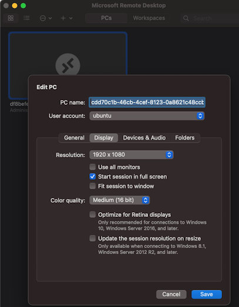
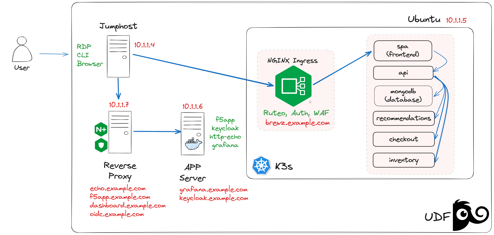

# NGINX Plus & NGINX Ingress Controller Lab

### IMPORTANT: All of the lab steps should be done from a Linux client via RDP (ubuntu-desktop)

To use the RDP connection, go to UDF --> ubuntu-desktop --> ACCESS --> XRDP
| User    | Password  |
|---------|-----------|
| ubuntu  | HelloUDF  |

It is recommended to set the RDP "color quality" option to the minimum for better performance.

| Windows                              | MacOS                            |
|--------------------------------------|----------------------------------|
|  |  |

## Lab Descripcion:

This lab includes:
- A Linux client with RDP from where all configurations will be done via CLI and tests via Browser
- An Ubuntu server with K3s, where the Ingress Controller will be deployed
- An Ubuntu server where NGINX Plus will be installed/configured
- An Ubuntu server with Docker doing the work of Application Server.

| **Service **          | **IP Address**   |
|-----------------------|------------------|
| brewz.example.com     | 10.1.1.5         |
| dashboard.example.com | 10.1.1.7         |
| echo.example.com      | 10.1.1.7         |
| f5app.example.com     | 10.1.1.7         |
| grafana.example.com   | 10.1.1.6         |
| keycloak.example.com  | 10.1.1.6         |
| oidc.example.com      | 10.1.1.5         |

## Lab Guides:
### [Part 1: NGINX Plus Lab](https://github.com/cavalen/nginx-workshop-cv/blob/main/docs/nginx/README.eng.md)

### [Part 2: GINX Ingress Controller Lab](https://github.com/cavalen/nginx-workshop-cv/blob/main/docs/k8s/README.eng.md)

:white_check_mark: **NOTE:** UDF BluePrint is [NGINX Workshop - CV](https://udf.f5.com/b/5d80a425-35e6-47fa-8753-bb7eedbd00ef#documentation)
