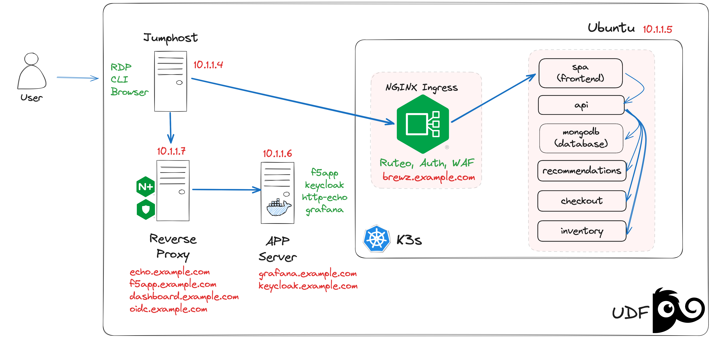

# Laboratorio NGINX Plus & NGINX Ingress Controller

### IMPORTANTE: Todas las configuraciones del Lab se haran desde un cliente Linux via RDP (ubuntu-desktop)

Para conectar, en UDF ir a ubuntu-desktop -> ACCESS -> XRDP
| Usuario | Password  |
|---------|-----------|
| ubuntu  | HelloUDF  |

\
Abrir la consola del Jumphost y clonar el repositorio del Lab

`git clone https://github.com/cavalen/nginx-workshop-cv`

---

## Descripcion del Entorno:

El laboratorio cuenta con:
- Un cliente Linux con RDP desde donde se haran todas las configuracions via Controla y las pruebas via Browser
- Un servidor Ubuntu con K3s, donde se hará el despliegue del Ingress Controller
- Un servidor Ubuntu donde se instalará NGINX Plus
- Un servidor Ubuntu con Docker haciendo la labor de Application Server.



| **Servicio**          | **Dirección IP** |
|-----------------------|------------------|
| brewz.example.com     | 10.1.1.5         |
| dashboard.example.com | 10.1.1.7         |
| echo.example.com      | 10.1.1.7         |
| f5app.example.com     | 10.1.1.7         |
| grafana.example.com   | 10.1.1.6         |
| keycloak.example.com  | 10.1.1.6         |
| oidc.example.com      | 10.1.1.5         |


## GUIAS:
## [Parte 1: Laboratorio NGINX Plus](https://github.com/cavalen/nginx-workshop-cv/tree/main/docs/k8s)

## [Parte 2: Laboratorio NGINX Ingress Controller](https://github.com/cavalen/nginx-workshop-cv/tree/main/docs/nginx)

---

## *Escenario 1: Despliegue de Brewz:*
##### Despligue del VirtualServer BREWZ con Active Healthchecks y Backup Service, en **https://brewz.cvlab.me**
- Crear el VirtualServer:
    ```sh
    kubectl apply -f 1-virtualserver-brewz.yaml
    kubectl get vs -n brewz
    ```
- Abrir el dashboard de Nginx Ingress y ver los healthchecks y upstreams: **https://dashboard.cvlab.me**
- Mostra la app en **https://brewz.cvlab.me**. Mostrar que no esta protegida (seguridad va mas adelante)
- Explicar como OpenShift no tiene visibilidad avanzada de los PODs de K8S, vemos como funcionan los HealthCheck activos mostrando el manifiesto `1-virtualserver-brewz.yaml`
- Abrir la consola de Openshift: **https://console-openshift-console.apps.jp0tvppu.eastus2.aroapp.io/**
    | Username | Password             |
    |----------|----------------------|
    | kubeadmin   | 6KK5V-IEni7-VHo8d-eLRvV |
- Mostrar la configuracion de Routes (Network > Routes > NS Brewz)
- Abrir Route: **http://route-brewz-brewz.apps.jp0tvppu.eastus2.aroapp.io**
- Simular fallo al pod de SPA: 
  - Shell al Pod:
    ```sh
    POD=$(kubectl get pod -n brewz -o custom-columns=:.metadata.name | grep spa | head -1); echo $POD
    kubectl exec -it -n brewz $POD -- sh
    ```
  - Editar el Web Server:
     ```sh
    cat <<EOF > /tmp/index.html
    <html>
      <body>
        <center>
          <h1> BREWZ is not feeling well ...</h1><p>
          
        </center>
      </body>
    </html>
    EOF
    ```
  - Aplicar cambios y reiniciar nginx:
    ```sh
    sed -i 's/\/usr\/share\/nginx\/html;/\/tmp;/g' /etc/nginx/nginx.conf
    nginx -s reload
    exit
    ```
  - Mostrar de nuevo el Dashboard de NGINX. con el monitor y el servicio
  - Refresh al router, debe mostrar un servicio no funcional (aunque con HTTP/200 OK)
  - Al refrescar el servicio via el Ingress (https://brewz.cvlab.me) se debe mostrar el servicio de Backup (spa-dark)
  - Explicar _Service Insight_ y hacer un curl al servicio
    -  `curl -k http://ingress.cvlab.me:9114/probe/brewz.cvlab.me`
  - Matar el pod con problemas:
    - `kubectl delete pod -n brewz $POD`
---
