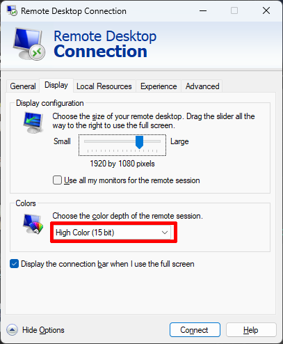

# Laboratorio NGINX Plus & NGINX Ingress Controller

### IMPORTANTE: Todas las configuraciones del Lab se haran desde un cliente Linux via RDP (ubuntu-desktop)

Para conectar, en UDF ir a ubuntu-desktop -> ACCESS -> XRDP
| Usuario | Password  |
|---------|-----------|
| ubuntu  | HelloUDF  |

Se recomienda colocar la calidad de colores a lo minimo para un mejor desempeño de la conexión RDP

| Windows                              | MacOS                            |
|--------------------------------------|----------------------------------|
|  |  |

:warning: Si hay problemas a la hora de realizar la conexión por RDP (Firewalls corportativos o lentitud en la conexión) se puede usar como alternativa [Guacamole](https://guacamole.apache.org/) que funciona como un proxy RDP via Web.

Guacamole esta habilitado en las opciones de Acceso del servidor `ubuntu-desktop` y desde alli se puede acceder al escritorio Linux.

| Usuario   | Password  |
|-----------|-----------|
| guacamole | guacamole |

## Descripcion del Entorno:

El laboratorio cuenta con:
- Un cliente Linux con RDP desde donde se haran todas las configuraciones via CLI y las pruebas via Browser
- Un servidor Ubuntu con K3s, donde se hará el despliegue del Ingress Controller
- Un servidor Ubuntu donde se hara la instalación/configuración de NGINX Plus
- Un servidor Ubuntu con Docker haciendo la labor de Application Server.

| **Servicio**          | **Dirección IP** |
|-----------------------|------------------|
| brewz.example.com     | 10.1.1.5         |
| dashboard.example.com | 10.1.1.7         |
| echo.example.com      | 10.1.1.7         |
| f5app.example.com     | 10.1.1.7         |
| grafana.example.com   | 10.1.1.6         |
| keycloak.example.com  | 10.1.1.6         |
| oidc.example.com      | 10.1.1.5         |

## GUIAS:
### [Parte 1: Laboratorio NGINX Plus](https://github.com/cavalen/nginx-workshop-cv/tree/main/docs/nginx#instrucciones-lab-nginx-plus)

### [Parte 2: Laboratorio NGINX Ingress Controller](https://github.com/cavalen/nginx-workshop-cv/tree/main/docs/k8s)

:white_check_mark: **NOTA:** El BluePrint de UDF es [NGINX Workshop - CV](https://udf.f5.com/b/5d80a425-35e6-47fa-8753-bb7eedbd00ef#documentation)