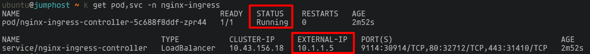
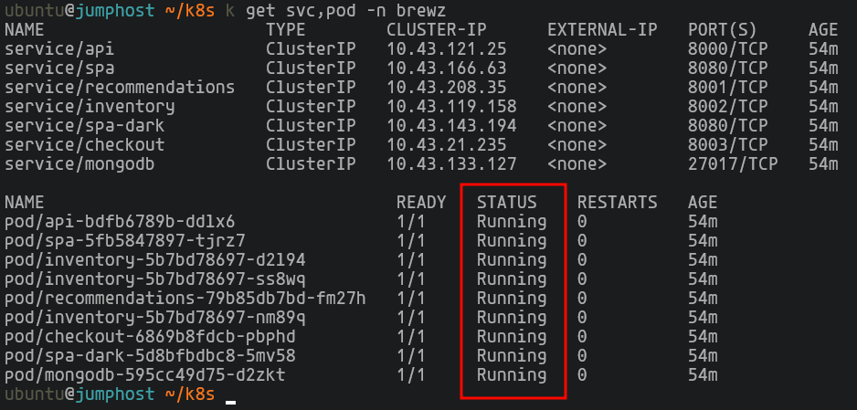
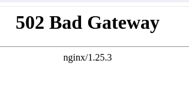

# NGINX Ingress Controller Lab

## Content:
[1. Pre-requisites](#1-prerequisites)\
[2. K8s Ingress Installation via Helm](#2-k8s-ingress-installation-via-helm)\
[3. BREWZ App Installation](#3-brewz-app-installation)\
[4. Publish an Ingress (Virtual Server)](#4-publish-an-ingress-virtual-server)\
[5. Active Healt Checks](#5-active-healt-checks)\
[6. Error Management](#6-error-management)\
[7. Web Application Firewall (WAF)](#7-web-application-firewall-waf)\
[8. JWT Auth](#8-jwt-auth)\
[9. Auth using OpenID Connect (OIDC)](#9-auth-using-openid-connect-oidc)

## 1. Prerequisites

> [!NOTE]
> :warning: **Note:** NGINX Ingress Controller instalation and configuration is done using the command line (CLI) with `helm`, `kubectl` and `YAML manifests` .
> Linux CLI and Kubernetes experience is recommended.

> :warning: **Note:** Using the CLI there is an alias for `kubectl`. The instructions use the alias `k`.

>  :warning: **IMPORTANT:** All the steps from this guide are done in the machine `ubuntu-desktop` (RDP Server). There is no need to do SSH to another machine for this section of the Lab.

> The Remote Desktop connection can cause difficulties when copying and pasting text from the guide. Try to follow the guide and running the CLI commands from the `ubuntu-desktop` RDP client or use the Webshell access to run the CLI commands and the RDP session to browse the applications.
> 


Inside the `ubuntu-desktop` open the console and clone the lab's repository
```
git clone https://github.com/cavalen/nginx-workshop-cv/
```
```
cd nginx-workshop-cv/k8s
```


## 2. K8s Ingress Installation via Helm

#### Install Helm:
```
helm repo add nginx-stable https://helm.nginx.com/stable
```
```
helm repo update
```

#### Install NGINX Ingress Controller via Helm:

We need to create a ConfigMap with the DNS Resolver and some other specific configurations needed for the OIDC integration in environments with more than one Ingress Controller replicas.

```
export DNSSVC=$(kubectl get svc -n kube-system kube-dns -o=jsonpath="{.spec.clusterIP}")
```
```
export CONFIGMAP_DATA=$(cat <<EOF
server {
  listen 12345;
  zone_sync;
  zone_sync_server nginx-ingress-headless.nginx-ingress.svc.cluster.local:12345 resolve;
}
EOF
)
```

> :bangbang: Edit the  `controller.image.repository` value for a valid one, example: `controller.image.repository=myregistry/nginx-plus-ingress`

> :bangbang: Edit the `controller.image.tag` value for a valid one, example: `controller.image.tag=3.5.0`

Note: Helm uses a YAML file (`values.yaml`) for configuration, we will be using a different approach passing all the options as flags instead of editing the values.yaml file.

```sh
helm install nginx-ingress nginx-stable/nginx-ingress \
  --namespace=nginx-ingress \
  --create-namespace \
  --set controller.kind=deployment \
  --set controller.replicaCount=1 \
  --set controller.image.repository=registry/repo \
  --set controller.image.tag=3.5.0 \
  --set controller.image.pullPolicy=IfNotPresent \
  --set controller.nginxplus=true \
  --set controller.appprotect.enable=true \
  --set controller.appprotectdos.enable=false \
  --set controller.ingressClass.create=true \
  --set controller.ingressClass.name="nginx-ingress" \
  --set controller.enableCustomResources=true \
  --set controller.enableSnippets=true \
  --set controller.enableTLSPassthrough=true \
  --set controller.enableOIDC=true \
  --set controller.healthStatus=true \
  --set controller.nginxStatus.enable=true \
  --set controller.nginxStatus.port=8080 \
  --set controller.nginxStatus.allowCidrs="0.0.0.0/0" \
  --set controller.service.name="nginx-ingress" \
  --set controller.service.type=LoadBalancer \
  --set controller.enableLatencyMetrics=true \
  --set prometheus.create=true \
  --set prometheus.port=9113 \
  --set serviceInsight.create=true \
  --set serviceInsight.port=9114 \
  --set controller.config.entries."resolver-addresses"="$DNSSVC" \
  --set controller.config.entries."resolver-valid"="5s" \
  --set controller.config.entries."stream-snippets=$CONFIGMAP_DATA" \
  --set "controller.service.customPorts[0].name"=insight \
  --set "controller.service.customPorts[0].nodePort"=30914 \
  --set "controller.service.customPorts[0].port"=9114 \
  --set "controller.service.customPorts[0].targetPort"=9114 \
  --set "controller.service.customPorts[0].protocol"=TCP
```
This command deploys an Ingress named `nginx-ingress`

  > Some of the options from the Helm command are:\
  > `namespace=nginx-ingress` Namespace to install the Ingress Controller. (Create the NS if it does not exist)
  > `controller.kind=deployment` Create de Ingress as a `Deployment`. Another option is to deploy as a `DaemonSet`\
  > `controller.replicaCount` Number of replicas.\
  > `controller.image.repository` Repository that Helm will use to pull the Ingress image\
  > `controller.nginxplus` Indicates if the deployment will use NGINX Plus instead of NGINX OSS\
  > `controller.appprotect.enable` Indicates if the NGINX App Protect WAF will be used\
  > `controller.enableCustomResources` Indicates that CDRs will be deployed. If not enabled, only `Ingress` resources can be used\
  > `controller.enableOIDC` Indicates if the OIDC integration will be used.\
  > `controller.nginxStatus.enable` Activate the NGINX Plus Dashboard
  > `serviceInsight.create` Activates the Service Insight functionality, this function enables visibilty and health state ot the application PODs.


Validate the deployment was successful and the Ingress is running with the following command:
```
k get pod,svc -n nginx-ingress
```


## 3. BREWZ App Installation

```sh
kubectl create ns brewz
```
```sh
k apply -f mongo-init.yaml -n brewz
```
```sh
k apply -f brewz-secret.yaml -n brewz
```
```sh
k apply -f brewz.yaml -n brewz
```
```sh
k get svc,pod -n brewz
```


## 4. Publish an Ingress (Virtual Server)

```sh
k apply -f 1-virtualserver-brewz.yaml -n brewz
```
```yaml
apiVersion: k8s.nginx.org/v1
kind: VirtualServer
metadata:
  name: brewz
  namespace: brewz
  annotations:
    version : "1. Basic Virtual Server"
spec:
  host: brewz.example.com
  tls:
    secret: brewz-secret
  upstreams:
    - name: spa
      service: spa
      port: 8080
      lb-method: round_robin
    - name: api
      service: api
      port: 8000
    - name: inventory
      service: inventory
      port: 8002
    - name: recommendations
      service: recommendations
      port: 8001
    - name: spa-dark
      service: spa-dark
      port: 8080
  routes:
    - path: /
      action:
        pass: spa
    - path: /api
      action:
        pass: api
    - path: /api/inventory
      action:
        proxy:
          upstream: inventory
          rewritePath: /api/inventory
    - path: /images
      action:
        proxy:
          upstream: api
          rewritePath: /images
    - path: /api/recommendations
      action:
        proxy:
          upstream: recommendations
          rewritePath: /api/recommendations
```
Validate:
```sh
k get vs -n brewz
```


Test the App in the browser - **https://brewz.example.com**

There is no security, we are only publishing the app

## 5. Active Healt Checks

Before making changes to the Ingress, let's simulate an application failure (a 200 OK response, but not what the application should response)

To do this, open an SSH connection to the application frontend POD (spa) and edit the web server:
```sh
POD=$(kubectl get pod -n brewz -o custom-columns=:.metadata.name | grep spa | head -1); echo $POD
```
This command put us in a shell inside the `spa` pod.
```sh
kubectl exec -it -n brewz $POD -- sh
```
Edit the Web Server:
```sh
cat <<EOF > /tmp/index.html
<html>
 <body>
   <center>
     <h1> BREWZ is not feeling well ...</h1><p>
     
   </center>
 </body>
</html>
EOF
```
Apply changes and restart the Web Server inside the POD:
```sh
sed -i 's/\/usr\/share\/nginx\/html;/\/tmp;/g' /etc/nginx/nginx.conf
nginx -s reload
exit
```
Browse to **https://brewz.example.com**\
The application is responding, but not what it should.

Now, let's add a Health-check to the Ingress definition, to detect this type of failures from the application (not necessarily a 500 Server Error response)

The difference between the previous version and the new one with Active Health Checks consist of 2 things:
* The first one expects a "200 OK" response from the POD and the string "Brewz".

  If both things are found in the response, the POD is marked as available.
  ```
    http-snippets: |
      match brewzhealthcheck {
        status 200;
        body ~ "Brewz";
      }
  ```
* The second change is to apply the Health check to the URL `/`, validating every 5 seconds
  ```
      - path: /
        location-snippets: |
          health_check match=brewzhealthcheck interval=5s uri=/;
  ```
The full manifest looks like this:
```yaml
apiVersion: k8s.nginx.org/v1
kind: VirtualServer
metadata:
  name: brewz
  namespace: brewz
  annotations:
    version : "2. Active Health Check"
spec:
  host: brewz.example.com
  tls:
    secret: brewz-secret
  http-snippets: |
    match brewzhealthcheck {
      status 200;
      body ~ "Brewz";
    }
  upstreams:
    - name: spa
      service: spa
      port: 8080
      lb-method: round_robin
    - name: api
      service: api
      port: 8000
    - name: inventory
      service: inventory
      port: 8002
    - name: recommendations
      service: recommendations
      port: 8001
    - name: spa-dark
      service: spa-dark
      port: 8080
  routes:
    - path: /
      location-snippets: |
        health_check match=brewzhealthcheck interval=5s uri=/;
      action:
        pass: spa
    - path: /api
      action:
        pass: api
    - path: /api/inventory
      action:
        proxy:
          upstream: inventory
          rewritePath: /api/inventory
    - path: /images
      action:
        proxy:
          upstream: api
          rewritePath: /images
    - path: /api/recommendations
      action:
        proxy:
          upstream: recommendations
          rewritePath: /api/recommendations
```
Let's apply the manifesto with Health Checks:
```sh
k apply -f 2-virtualserver-brewz.yaml -n brewz
```

Test the Application, now with Health Checks:

Go to **https://brewz.example.com**

The application is in a failed state. Since we edited the Application POD and the Health Check is looking for the string "Brewz" and does not find it, the Ingress responds with an HTTP/502 error code (there are no PODs available in the Backend)



## 6. Error Management

In this scenario we want the Ingress to intercept this 502 error and not present it to the user, and instead respond with some content. This is achieved through a directive called `errorPages`

This directive is added to the existing configuration, intercepting 502 and 503 errors and responding with static content (218 HTTP code).

```
      errorPages:
      - codes: [502, 503]
        return:
          code: 218
          body: "<center><h1>Tenemos inconvenientes tecnicos y estamos trabajando para solucionarlo ;) .. </h1><p> </p></center>"

```

Let's review the full manifest that does this:
```yaml
apiVersion: k8s.nginx.org/v1
kind: VirtualServer
metadata:
  name: brewz
  namespace: brewz
  annotations:
    version : "3. Errors & responses"
spec:
  host: brewz.example.com
  tls:
    secret: brewz-secret
  http-snippets: |
    match brewzhealthcheck {
      status 200;
      body ~ "Brewz";
    }
  upstreams:
    - name: spa
      service: spa
      port: 8080
      lb-method: round_robin
    - name: api
      service: api
      port: 8000
    - name: inventory
      service: inventory
      port: 8002
    - name: recommendations
      service: recommendations
      port: 8001
    - name: spa-dark
      service: spa-dark
      port: 8080
  routes:
    - path: /
      location-snippets: |
        health_check match=brewzhealthcheck interval=5s uri=/;
      errorPages:
      - codes: [502, 503]
        return:
          code: 218
          body: "<center><h1>We are having technical issues and working to bring the service back ;) .. </h1><p> </p></center>"
      action:
        pass: spa
    - path: /api
      action:
        pass: api
    - path: /api/inventory
      action:
        proxy:
          upstream: inventory
          rewritePath: /api/inventory
    - path: /images
      action:
        proxy:
          upstream: api
          rewritePath: /images
    - path: /api/recommendations
      action:
        proxy:
          upstream: recommendations
          rewritePath: /api/recommendations
```
Let's apply the changes:
```sh
k apply -f 3-virtualserver-brewz.yaml -n brewz
```
Go back to **https://brewz.example.com**

Validate the error message, now modified by the Ingress

:warning: Finally, delete the "failed" POD
```sh
k delete pod $POD -n brewz
```

## 7. Web Application Firewall (WAF)

The next step on the road to improve the user experience and security of the Brewz app is to enable Layer 7 security using the WAF.

We will apply a WAF policy to the `/` and `/api` paths

First we need to apply the security policy:\
The policy is very similar to the one deployed in the NGINX Plus lab, but in this case it is a K8s object (CRD)

In the `k8s/waf` folder you will find the security policy and the objects related to it. Apply the manifests in order:

```sh
k apply -f waf/1-waf-ap-logconf-grafana.yaml -n brewz
k apply -f waf/2-waf-ap-custom-signatures.yaml -n brewz
k apply -f waf/3-waf-ap-policy-spa.yaml -n brewz
k apply -f waf/4-waf-policy-spa.yaml -n brewz
```
### 1-waf-ap-logconf-grafana.yaml
This manifest contains the log configuration such as the format and types of **request** to send to the log (illegal), in this case a specific log format is used for a Grafana dashboard.\
There is a `default` format suited to basic logs via syslog and other predefined formats such as `big-iq`, `arcsight`, `grpc`, `splunk` and `user-defined` which is the one used in this Lab.
```yaml
apiVersion: appprotect.f5.com/v1beta1
kind: APLogConf
metadata:
  name: logconf-grafana
spec:
  content:
    format: user-defined
    format_string: "{\"campaign_names\":\"%threat_campaign_names%\",\"bot_signature_name\":\"%bot_signature_name%\",\"bot_category\":\"%bot_category%\",\"bot_anomalies\":\"%bot_anomalies%\",\"enforced_bot_anomalies\":\"%enforced_bot_anomalies%\",\"client_class\":\"%client_class%\",\"client_application\":\"%client_application%\",\"json_log\":%json_log%}"
    max_message_size: 30k
    max_request_size: "500"
    escaping_characters:
    - from: "%22%22"
      to: "%22"
  filter:
    request_type: illegal
```

### 2-waf-ap-custom-signatures.yaml
This manifest configures user signatures, which allow you to define, for example, a text string that triggers the signature and is blocked by the WAF. In this case, a request with the word `hackerz` triggers this attack signature.
```yaml
apiVersion: appprotect.f5.com/v1beta1
kind: APUserSig
metadata:
  name: hackerz-sig
spec:
  signatures:
  - accuracy: medium
    attackType:
      name: Brute Force Attack
    description: Medium accuracy user defined signature with tag (BadActors)
    name: Hacker_medium_acc
    risk: medium
    rule: content:"hackerz"; nocase;
    signatureType: request
    systems:
    - name: Microsoft Windows
    - name: Unix/Linux
  tag: BadActors
```

### 3-waf-ap-policy-spa.yaml
This is the main security policy and includes several sections such as (among others):
* Type of blocking (enforcementMode) which can be `transparent` or `blocking`
* User signatures
* Violations
* BOT blocking settings, based on signatures
* Evasions
* Dataguard (obfuscation/blocking of sensitive information provided by the server)
* WAF response page in case of a violation
* Whitelisted IPs
```yaml
apiVersion: appprotect.f5.com/v1beta1
kind: APPolicy
metadata:
  name: brewz-spa-security-policy
spec:
  policy:
    name: brewz-spa-security-policy
    template:
      name: POLICY_TEMPLATE_NGINX_BASE
    applicationLanguage: utf-8
    enforcementMode: blocking
    signature-requirements:
    - tag: BadActors
    signature-sets:
    - name: hackerz-sig
      block: true
      signatureSet:
        filter:
          tagValue: BadActors
          tagFilter: eq
    bot-defense:
      settings:
        isEnabled: false
    blocking-settings:
      violations:
        - block: true
          description: Disallowed file upload content detected in body
          name: VIOL_FILE_UPLOAD_IN_BODY
        - block: true
          description: Mandatory request body is missing
          name: VIOL_MANDATORY_REQUEST_BODY
        - block: true
          description: Illegal parameter location
          name: VIOL_PARAMETER_LOCATION
        - block: true
          description: Mandatory parameter is missing
          name: VIOL_MANDATORY_PARAMETER
        - block: true
          description: JSON data does not comply with JSON schema
          name: VIOL_JSON_SCHEMA
        - block: true
          description: Illegal parameter array value
          name: VIOL_PARAMETER_ARRAY_VALUE
        - block: true
          description: Illegal Base64 value
          name: VIOL_PARAMETER_VALUE_BASE64
        - block: true
          description: Disallowed file upload content detected
          name: VIOL_FILE_UPLOAD
        - block: true
          description: Illegal request content type
          name: VIOL_URL_CONTENT_TYPE
        - block: true
          description: Illegal static parameter value
          name: VIOL_PARAMETER_STATIC_VALUE
        - block: true
          description: Illegal parameter value length
          name: VIOL_PARAMETER_VALUE_LENGTH
        - block: true
          description: Illegal parameter data type
          name: VIOL_PARAMETER_DATA_TYPE
        - block: true
          description: Illegal parameter numeric value
          name: VIOL_PARAMETER_NUMERIC_VALUE
        - block: true
          description: Parameter value does not comply with regular expression
          name: VIOL_PARAMETER_VALUE_REGEXP
        - block: false
          description: Illegal URL
          name: VIOL_URL
        - block: true
          description: Illegal parameter
          name: VIOL_PARAMETER
        - block: true
          description: Illegal empty parameter value
          name: VIOL_PARAMETER_EMPTY_VALUE
        - block: true
          description: Illegal repeated parameter name
          name: VIOL_PARAMETER_REPEATED
        - alarm: true
          block: false
          name: VIOL_DATA_GUARD
        - alarm: true
          block: false
          name: VIOL_EVASION
        - alarm: true
          block: false
          name: VIOL_RATING_THREAT
      evasions:
      - description: "Multiple decoding"
      - enabled: true
      - maxDecodingPasses: 2
    server-technologies:
    - serverTechnologyName: MongoDB
    - serverTechnologyName: Unix/Linux
    - serverTechnologyName: Node.js
    - serverTechnologyName: Nginx
    data-guard:
      creditCardNumbers: true
      enabled: true
      enforcementMode: ignore-urls-in-list
      enforcementUrls: []
      lastCcnDigitsToExpose: 4
      lastSsnDigitsToExpose: 4
      maskData: true
      usSocialSecurityNumbers: true
    responsePageReference:
      link: "https://raw.githubusercontent.com/cavalen/acme/master/response-pages-v2.json"
    whitelistIpReference:
      link: "https://raw.githubusercontent.com/cavalen/acme/master/whitelist-ips.json"
```

### 4-waf-policy-spa.yaml
This manifest defines the security policy that references the other WAF configurations and the destination and format of the logs.
```yaml
apiVersion: k8s.nginx.org/v1
kind: Policy
metadata:
  name: waf-policy-spa
spec:
  waf:
    enable: true
    apPolicy: "brewz/brewz-spa-security-policy"
    securityLog:
      enable: true
      apLogConf: "brewz/logconf-grafana"
      #logDest: "syslog:server=logstash.monitoring.svc.cluster.local:5044"
      logDest: "syslog:server=grafana.example.com:8515"
```

Finally, deploy the VirtualServer with the changes and the active WAF policy:\
The change with respect to the previous configuration is the addition of the `policies` directive in the `/` and `/api` paths:
```
policies:
  - name: waf-policy-spa
```
```yaml
apiVersion: k8s.nginx.org/v1
kind: VirtualServer
metadata:
  name: brewz
  namespace: brewz
  annotations:
    version : "4. WAF"
spec:
  host: brewz.example.com
  tls:
    secret: brewz-secret
  http-snippets: |
    match brewzhealthcheck {
      status 200;
      body ~ "Brewz";
    }
  upstreams:
    - name: spa
      service: spa
      port: 8080
      lb-method: round_robin
    - name: api
      service: api
      port: 8000
    - name: inventory
      service: inventory
      port: 8002
    - name: recommendations
      service: recommendations
      port: 8001
    - name: spa-dark
      service: spa-dark
      port: 8080
  routes:
    - path: /
      policies:
        - name: waf-policy-spa
      location-snippets: |
        health_check match=brewzhealthcheck interval=5s uri=/;
      errorPages:
      - codes: [502, 503]
        return:
          code: 218
          body: "<center><h1>We are having technical issues and working to bring the service back ;) .. </h1><p> </p></center>"
      action:
        pass: spa
    - path: /api
      policies:
        - name: waf-policy-spa
      action:
        pass: api
    - path: /api/inventory
      action:
        proxy:
          upstream: inventory
          rewritePath: /api/inventory
    - path: /images
      action:
        proxy:
          upstream: api
          rewritePath: /images
    - path: /api/recommendations
      action:
        proxy:
          upstream: recommendations
          rewritePath: /api/recommendations
```

Apply the changes:
```sh
k apply -f 4-virtualserver-brewz.yaml -n brewz
```

Validate in **https://brewz.example.com**, Visit the first item in the store and see that there is an obfuscated credit card number

Try some basic attacks like XSS or SQLi:

XSS: `https://brewz.example.com/<script>`\
SQLi: `https://brewz.example.com/?param=' or 1=1#'`


## 8. JWT Auth

We will apply a JWT policy called `jwt-policy-brewz`

In the `k8s/jwt` folder you will find the authentication policy with tokens and a secret corresponding to the JWK (Key)

Let's apply the JWT policies, first the secret, then the "Policy"

```sh
k apply -f jwt/1-jwt-secret.yaml -n brewz
k apply -f jwt/2-jwt-policy.yaml -n brewz
```

The `jwt/1-jwt-secret.yaml` file is basically a K8s-secret, where the JSON Web Key is stored. The JWK is a JSON structure that represents a set of public keys, used to verify the token (JWT) created by an authorization server.

```yaml
apiVersion: v1
kind: Secret
metadata:
  name: jwk-secret
type: nginx.org/jwk
data:
  jwk: eyJrZXlzIjoKICAgIFt7CiAgICAgICAgImsiOiJabUZ1ZEdGemRHbGphbmQwIiwKICAgICAgICAia3R5Ijoib2N0IiwKICAgICAgICAia2lkIjoiMDAwMSIKICAgIH1dCn0K
```

The `jwt/2-jwt-policy.yaml` file is the JWT Ingress policy, it references the previous secret and obtains it from the client request from the `$http_token` parameter. In NGINX `$http_token` represents the `token` Header in the HTTP request.
```yaml
apiVersion: k8s.nginx.org/v1
kind: Policy
metadata:
  name: jwt-policy-brewz
spec:
  jwt:
    realm: BrewzAPI
    secret: jwk-secret
    token: $http_token
```
Asociaremos la politica `jwt-policy-brewz` al endpoint `/api/recommendations` por medio de la directiva `policies`:
> ```
>     - path: /api/recommendations
>       policies:
>         - name: jwt-policy-brewz
> ```
Finally we apply the updated Ingress manifest with the JWT Authentication policy:
```
k apply -f 5-virtualserver-brewz.yaml -n brewz
```
The tests to validate JWT Authentication are done from the CLI with `curl`

Endpoint with no authentication:
```sh
curl -s -k https://brewz.example.com/api/inventory | jq
```

 Endpoint `/recommendations` with authentication (response should be a 401 Error):
```sh
curl -s -k https://brewz.example.com/api/recommendations
```

Let's try with an invalid token, sent in the Header *token* (response should be a 401 Error):
```sh
curl -k -i -H "token: `cat jwt/token-bad.jwt`" https://brewz.example.com/api/recommendations
```

Let's try with an valid token, sent in the Header *token*:
```sh
curl -k -s -H "token: `cat jwt/token-good.jwt`" https://brewz.example.com/api/recommendations | jq
```

## 9. Auth using OpenID Connect (OIDC)

Let's create a new endpoint `/admin` in the Ingress definition that responds with static content. Then we will associate an OIDC policy called `oidc-policy-brewz` to this endpoint. This will result in a call to Keycloak asking for valid credentials before taking the user to this endpoint.

First we need to create the OIDC policy and the Client Secret to interact with Keycloak. The manifests are located in the `k8s/oidc` folder
```sh
k apply -f oidc/1-oidc-client-secret.yaml -n brewz
k apply -f oidc/2-oidc-brewz.yaml -n brewz
```

The `oidc/1-oidc-client-secret.yaml` file is the Client-Secret needed to interact with the IdP
```yaml
apiVersion: v1
kind: Secret
metadata:
  name: oidc-secret
type: nginx.org/oidc
data:
  client-secret: MTIzNDU2Nzg5MEFCQ0RFRg==
```
The `oidc/2-oidc-brewz.yaml` file is the OIDC policy, with the endpoints needed to exchange information with the IdP

The Identity Provider administrator must know these values, additionally the `openid-configurations` URL (**http://keycloak.example.com/realms/master/.well-known/openid-configuration**) can help us obtain this information.

```yaml
apiVersion: k8s.nginx.org/v1
kind: Policy
metadata:
  name: oidc-policy-brewz
spec:
  oidc:
    clientID: nginx-plus-brewz
    clientSecret: oidc-secret
    authEndpoint: https://keycloak.example.com/realms/master/protocol/openid-connect/auth
    tokenEndpoint: https://keycloak.example.com/realms/master/protocol/openid-connect/token
    jwksURI: https://keycloak.example.com/realms/master/protocol/openid-connect/certs
    scope: openid+profile+email
    accessTokenEnable: true
```
Let's apply the VirtualServer changes
```sh
k apply -f 6-virtualserver-brewz.yaml -n brewz
```
The changes made to the VirtualServer manifest are:
- A new `/admin` path, which responds with static content.
- Addition of the `oidc-policy-brewz` policy to the `/admin` path
```
    - path: /admin
      policies:
        - name: oidc-policy-brewz
      action:
        return:
          code: 200
          type: text/html
          body: "<center><h1><br>Para estar aca requieres autenticarte con Keycloak !!</h1></center>"
```

The updated VirtualServer manifest:
```yaml
apiVersion: k8s.nginx.org/v1
kind: VirtualServer
metadata:
  name: brewz
  namespace: brewz
  annotations:
    version : "4. WAF"
spec:
  host: brewz.example.com
  tls:
    secret: brewz-secret
  http-snippets: |
    match brewzhealthcheck {
      status 200;
      body ~ "Brewz";
    }
  upstreams:
    - name: spa
      service: spa
      port: 8080
      lb-method: round_robin
    - name: api
      service: api
      port: 8000
    - name: inventory
      service: inventory
      port: 8002
    - name: recommendations
      service: recommendations
      port: 8001
    - name: spa-dark
      service: spa-dark
      port: 8080
  routes:
    - path: /
      policies:
        - name: waf-policy-spa
      location-snippets: |
        health_check match=brewzhealthcheck interval=5s uri=/;
      errorPages:
      - codes: [502, 503]
        return:
          code: 218
          body: "<center><h1>We are having technical issues and working to bring the service back ;) .. </h1><p> </p></center>"
      action:
        pass: spa
    - path: /api
      policies:
        - name: waf-policy-spa
      action:
        pass: api
    - path: /api/inventory
      action:
        proxy:
          upstream: inventory
          rewritePath: /api/inventory
    - path: /images
      action:
        proxy:
          upstream: api
          rewritePath: /images
    - path: /api/recommendations
      policies:
        - name: jwt-policy-brewz
      action:
        proxy:
          upstream: recommendations
          rewritePath: /api/recommendations
    - path: /admin
      policies:
        - name: oidc-policy-brewz
      action:
        return:
          code: 200
          type: text/html
          body: "<center><h1><br>Para estar aca requieres autenticarte con Keycloak !!</h1></center>"
```
In the browser go to **https://brewz.example.com/admin** and it should request authentication from Keycloak, use the credentials `test:test`, once validated it should show the content of the endpoint.

- FIN -
