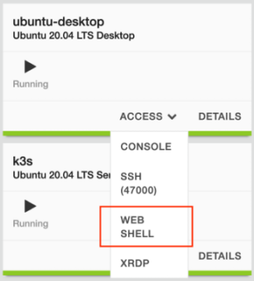

# Instrucciones Lab NGINX Ingress Controller

## Contenido:
[1. Pre-requisitos](#1-pre-requisitos)\
[2. Instalación K8s Ingress via Helm](#2-instalación-k8s-ingress-via-helm)\
[3. Instalar App BREWZ](#3-instalar-app-brewz)\
[4. Publicar un Ingress (Virtual Server)](#4-publicar-un-ingress-virtual-server)\
[5. HealtChecks Activos](#5-healtchecks-activos)\
[6. Manejo de Errores](#6-manejo-de-errores)\
[7. Web Application Firewall (WAF)](#7-web-application-firewall-waf)\
[8. JWT Auth](#8-jwt-auth)\
[9. Integración IdP con OIDC](#9-integración-idp-con-oidc)

## 1. Pre-requisitos

> [!NOTE]
> La instalación y la configuración de NGINX Ingress Controller se realizar por linea de comandos usando `kubectl` y manifiestos en formato YAML.
> Se recomienda tener alguna experiencia en el CLI de Linux y Kubernetes.
>
> En la linea de comandos hay un alias para `kubectl`. Los comandos de la guía se harán con el alias `k`

> [!IMPORTANT]
> Los pasos de configuración de esta guía se deben hacer sobre el servidor `ubuntu-desktop`, que es el servidor RDP. No hay necesidad de hacer SSH a otro equipo para esta sección del Lab.

> [!IMPORTANT]
> Copiar y Pegar entre el servidor `ubuntu-desktop` y el equipo local puede resultar en errores de formato del texto copiado, lo que se traducen en errores a la hora de desplegar las configuraciones.
>
> Se recomienda ejecutar el laboratorio en su totalidad desde el RDP `ubuntu-desktop` (guia + CLI) o usar la opcion de UDF de WebShell al servidor `ubuntu-desktop` y seguir la guia desde el PC local.
> 


Abrir la consola del Jumphost y clonar el repositorio del Lab
```
git clone https://github.com/cavalen/nginx-workshop-cv/
```
```
cd nginx-workshop-cv/k8s
```


## 2. Instalación K8s Ingress via Helm

#### Instalar Helm:
```
helm repo add nginx-stable https://helm.nginx.com/stable
```
```
helm repo update
```

#### Instalar NGINX Ingress Controller via Helm:

Es necesario crear un ConfigMap donde se especifique el resolver de DNS y unas configuraciones adicionales necesarias para OIDC en entornos donde hay mas de una replica del Ingress Controller.

```
export DNSSVC=$(kubectl get svc -n kube-system kube-dns -o=jsonpath="{.spec.clusterIP}"); echo $DNSSVC
```
```
export CONFIGMAP_DATA=$(cat <<EOF
server {
  listen 12345;
  zone_sync;
  zone_sync_server nginx-ingress-headless.nginx-ingress.svc.cluster.local:12345 resolve;
}
EOF
)
```

> :bangbang: Editar el valor de `controller.image.repository` por uno válido, ej. `controller.image.repository=myregistry/nginx-plus-ingress`

> :bangbang: Editar el valor de `controller.image.tag` por uno valido, ej. `controller.image.tag=3.5.0`

```sh
helm install nginx-ingress nginx-stable/nginx-ingress \
  --namespace=nginx-ingress \
  --create-namespace \
  --set controller.kind=deployment \
  --set controller.replicaCount=1 \
  --set controller.image.repository=registry/repo \
  --set controller.image.tag=3.5.0 \
  --set controller.image.pullPolicy=IfNotPresent \
  --set controller.nginxplus=true \
  --set controller.appprotect.enable=true \
  --set controller.appprotectdos.enable=false \
  --set controller.ingressClass.create=true \
  --set controller.ingressClass.name="nginx-ingress" \
  --set controller.enableCustomResources=true \
  --set controller.enableSnippets=true \
  --set controller.enableTLSPassthrough=true \
  --set controller.enableOIDC=true \
  --set controller.healthStatus=true \
  --set controller.nginxStatus.enable=true \
  --set controller.nginxStatus.port=8080 \
  --set controller.nginxStatus.allowCidrs="0.0.0.0/0" \
  --set controller.service.name="nginx-ingress" \
  --set controller.service.type=LoadBalancer \
  --set controller.enableLatencyMetrics=true \
  --set prometheus.create=true \
  --set prometheus.port=9113 \
  --set serviceInsight.create=true \
  --set serviceInsight.port=9114 \
  --set controller.config.entries."resolver-addresses"="$DNSSVC" \
  --set controller.config.entries."resolver-valid"="5s" \
  --set controller.config.entries."stream-snippets=$CONFIGMAP_DATA" \
  --set "controller.service.customPorts[0].name"=insight \
  --set "controller.service.customPorts[0].nodePort"=30914 \
  --set "controller.service.customPorts[0].port"=9114 \
  --set "controller.service.customPorts[0].targetPort"=9114 \
  --set "controller.service.customPorts[0].protocol"=TCP
```
Este comando despliega un ingress llamado `nginx-ingress`\
>> :warning: NOTA: Si a la hora de desplegar el Ingress se presenta un error, es necesario "desinstalar" el despliegue fallido antes de intentarlo nuevamente, con el comando `helm uninstall nginx-ingress -n nginx-ingress`


  > Algunas de las opciones del comando son:\
  > `namespace=nginx-ingress` Instala sobre el namespace nginx-ingress y lo crea si no existe
  > `controller.kind=deployment` Crea un despliegue tipo `Deployment`, la otra opcion es `DaemonSet`\
  > `controller.replicaCount` Numero de replicas del Deploy del Ingress.\
  > `controller.image.repository` Indica el repositorio donde se obtiene la imagen del Ingress\
  > `controller.nginxplus` Indica que se usara NGINX Plus como Ingress, en lugar de NGINX OSS\
  > `controller.appprotect.enable` Indica que se utilizara el WAF\
  > `controller.enableCustomResources` Indica que se utilizaran los CRDs de Nginx\
  > `controller.enableOIDC` Indica que la integración con OIDC estará disponible\
  > `controller.nginxStatus.enable` Activa el dashboard de NGINX Plus
  > `serviceInsight.create` Activa la funcionalidad de Service Insight, que es una funcion para dar visibilidad del estado de salud de los servicios y pods.


Validar que el despliegue es correcto y el Ingress esta corriendo con el comando:
```
k get pod,svc -n nginx-ingress
```


## 3. Instalar App BREWZ

```sh
kubectl create ns brewz
```
```sh
k apply -f mongo-init.yaml -n brewz
```
```sh
k apply -f brewz-secret.yaml -n brewz
```
```sh
k apply -f brewz.yaml -n brewz
```
```sh
k get svc,pod -n brewz
```


## 4. Publicar un Ingress (Virtual Server)

```sh
k apply -f 1-virtualserver-brewz.yaml -n brewz
```
```yaml
apiVersion: k8s.nginx.org/v1
kind: VirtualServer
metadata:
  name: brewz
  namespace: brewz
  annotations:
    version : "1. Basic Virtual Server"
spec:
  host: brewz.example.com
  tls:
    secret: brewz-secret
  upstreams:
    - name: spa
      service: spa
      port: 8080
      lb-method: round_robin
    - name: api
      service: api
      port: 8000
    - name: inventory
      service: inventory
      port: 8002
    - name: recommendations
      service: recommendations
      port: 8001
    - name: spa-dark
      service: spa-dark
      port: 8080
  routes:
    - path: /
      action:
        pass: spa
    - path: /api
      action:
        pass: api
    - path: /api/inventory
      action:
        proxy:
          upstream: inventory
          rewritePath: /api/inventory
    - path: /images
      action:
        proxy:
          upstream: api
          rewritePath: /images
    - path: /api/recommendations
      action:
        proxy:
          upstream: recommendations
          rewritePath: /api/recommendations
```
Validar:
```sh
k get vs -n brewz
```


Probar la app en el Browser en **https://brewz.example.com**

No tiene seguridad, solo se esta exponiendo la app

## 5. HealtChecks Activos

Antes de hacer cambios al Ingress, simulamos un fallo en la aplicación (ej, responder con un 200 OK pero no lo que la aplicación debe responder)

Para esto entramos por SSH al POD del frontend (spa) y editamos el web server:
```sh
POD=$(kubectl get pod -n brewz -o custom-columns=:.metadata.name | grep spa | head -1); echo $POD
```
Este comando nos pone en un shell en el pod `spa` de Brewz
```sh
kubectl exec -it -n brewz $POD -- sh
```
Editar Web Server:
```sh
cat <<EOF > /tmp/index.html
<html>
 <body>
   <center>
     <h1> BREWZ is not feeling well ...</h1><p>
     
   </center>
 </body>
</html>
EOF
```
Aplicar cambios y reiniciar el Web Server del POD:
```sh
sed -i 's/\/usr\/share\/nginx\/html;/\/tmp;/g' /etc/nginx/nginx.conf
nginx -s reload
exit
```
Ir a **https://brewz.example.com**\
La aplicación claramente esta respondiendo, pero no lo que esperamos.

Adicionaremos un Health-check al Ingress para detectar este tipo de fallas, mas allá de un código de respuesta HTTP 500 del POD.\
El cambio de la configuración respecto al anterior consiste 2 bloques, el primero espera del POD una respuesta 200 OK y la cadena "Brewz".\
Si encuentra las 2 cosas en la respuesta se marca el POD como disponible.
```
  http-snippets: |
    match brewzhealthcheck {
      status 200;
      body ~ "Brewz";
    }
```
El segundo cambio consiste en aplicar el Health check al URL `/`, validando cada 5 segundos
```
    - path: /
      location-snippets: |
        health_check match=brewzhealthcheck interval=5s uri=/;
```
El manifiesto completo se ve asi:
```yaml
apiVersion: k8s.nginx.org/v1
kind: VirtualServer
metadata:
  name: brewz
  namespace: brewz
  annotations:
    version : "2. Active Health Check"
spec:
  host: brewz.example.com
  tls:
    secret: brewz-secret
  http-snippets: |
    match brewzhealthcheck {
      status 200;
      body ~ "Brewz";
    }
  upstreams:
    - name: spa
      service: spa
      port: 8080
      lb-method: round_robin
    - name: api
      service: api
      port: 8000
    - name: inventory
      service: inventory
      port: 8002
    - name: recommendations
      service: recommendations
      port: 8001
    - name: spa-dark
      service: spa-dark
      port: 8080
  routes:
    - path: /
      location-snippets: |
        health_check match=brewzhealthcheck interval=5s uri=/;
      action:
        pass: spa
    - path: /api
      action:
        pass: api
    - path: /api/inventory
      action:
        proxy:
          upstream: inventory
          rewritePath: /api/inventory
    - path: /images
      action:
        proxy:
          upstream: api
          rewritePath: /images
    - path: /api/recommendations
      action:
        proxy:
          upstream: recommendations
          rewritePath: /api/recommendations
```
Aplicamos el manifiesto con Health Checks:
```sh
k apply -f 2-virtualserver-brewz.yaml -n brewz
```

Probar el Health Check:

Ir a **https://brewz.example.com**

Como editamos el POD del Aplicativo y el Health Check busca la cadena "Brewz" y  no la encuentra, el Ingress responde con un código de error HTTP/502 (no hay PODs disponibles en el Backend)


## 6. Manejo de Errores

En este escenario buscamos que el Ingress intercepte este error 502 y no lo presente al usuario, sino que responda con algún contenido. Esto se logra por medio de una directiva llamada `errorPages`

Se adiciona a la configuración existente esta directiva, interceptando errores 502 y 503 y respondiendo con un contenido estático.
```
      errorPages:
      - codes: [502, 503]
        return:
          code: 218
          body: "<center><h1>Tenemos inconvenientes tecnicos y estamos trabajando para solucionarlo ;) .. </h1><p> </p></center>"

```

Revisemos el manifiesto completo que hace esto:
```yaml
apiVersion: k8s.nginx.org/v1
kind: VirtualServer
metadata:
  name: brewz
  namespace: brewz
  annotations:
    version : "3. Errors & responses"
spec:
  host: brewz.example.com
  tls:
    secret: brewz-secret
  http-snippets: |
    match brewzhealthcheck {
      status 200;
      body ~ "Brewz";
    }
  upstreams:
    - name: spa
      service: spa
      port: 8080
      lb-method: round_robin
    - name: api
      service: api
      port: 8000
    - name: inventory
      service: inventory
      port: 8002
    - name: recommendations
      service: recommendations
      port: 8001
    - name: spa-dark
      service: spa-dark
      port: 8080
  routes:
    - path: /
      location-snippets: |
        health_check match=brewzhealthcheck interval=5s uri=/;
      errorPages:
      - codes: [502, 503]
        return:
          code: 218
          body: "<center><h1>We are having technical issues and working to bring the service back ;) .. </h1><p> </p></center>"
      action:
        pass: spa
    - path: /api
      action:
        pass: api
    - path: /api/inventory
      action:
        proxy:
          upstream: inventory
          rewritePath: /api/inventory
    - path: /images
      action:
        proxy:
          upstream: api
          rewritePath: /images
    - path: /api/recommendations
      action:
        proxy:
          upstream: recommendations
          rewritePath: /api/recommendations
```
Aplicamos los cambios:
```sh
k apply -f 3-virtualserver-brewz.yaml -n brewz
```
Volver a **https://brewz.example.com**

Validar el mensaje de error, ahora modificado por el Ingress

Por último, eliminar el POD "fallido"
```sh
k delete pod $POD -n brewz
```

## 7. Web Application Firewall (WAF)

El siguiente paso en el camino a mejorar la experiencia del usuario y la seguridad de la aplicación Brewz es activar seguridad en L7 por medio del WAF.

Aplicamos una política de WAF a las rutas `/` y `/api`

Primero debemos aplicar la política de seguridad:\
La policy es muy similar a la desplegada en el lab de NGINX Plus, pero en este caso son objetos de K8s (CRDs)

En la carpeta del laboratorio `k8s/waf` se encuentra la política de seguridad y los objetos relacionados a esta. Aplicar los manifiestos en orden:

```sh
k apply -f waf/1-waf-ap-logconf-grafana.yaml -n brewz
k apply -f waf/2-waf-ap-custom-signatures.yaml -n brewz
k apply -f waf/3-waf-ap-policy-spa.yaml -n brewz
k apply -f waf/4-waf-policy-spa.yaml -n brewz
```
### 1-waf-ap-logconf-grafana.yaml
Este manifiesto contiene la configuración de logs del WAF como el formato y los tipos de **request** a enviar al log (ilegales), en este caso se usa un formato de log especifico para un dashboard de Grafana.\
Existe un formato `default` orientado a logs básicos via syslog y otros formatos predefinidos como `big-iq`, `arcsight`, `grpc`, `splunk` y `user-defined` que es el utilizado en este Lab.
```yaml
apiVersion: appprotect.f5.com/v1beta1
kind: APLogConf
metadata:
  name: logconf-grafana
spec:
  content:
    format: user-defined
    format_string: "{\"campaign_names\":\"%threat_campaign_names%\",\"bot_signature_name\":\"%bot_signature_name%\",\"bot_category\":\"%bot_category%\",\"bot_anomalies\":\"%bot_anomalies%\",\"enforced_bot_anomalies\":\"%enforced_bot_anomalies%\",\"client_class\":\"%client_class%\",\"client_application\":\"%client_application%\",\"json_log\":%json_log%}"
    max_message_size: 30k
    max_request_size: "500"
    escaping_characters:
    - from: "%22%22"
      to: "%22"
  filter:
    request_type: illegal
```

### 2-waf-ap-custom-signatures.yaml
Este manifiesto configura firmas de ataque de usuario (user signatures), donde se permite definir por ejemplo una cadena de texto que active la firma y sea bloqueada por el WAF. En este caso un request con la palabra `hackerz` activa esta firma de ataque.
```yaml
apiVersion: appprotect.f5.com/v1beta1
kind: APUserSig
metadata:
  name: hackerz-sig
spec:
  signatures:
  - accuracy: medium
    attackType:
      name: Brute Force Attack
    description: Medium accuracy user defined signature with tag (BadActors)
    name: Hacker_medium_acc
    risk: medium
    rule: content:"hackerz"; nocase;
    signatureType: request
    systems:
    - name: Microsoft Windows
    - name: Unix/Linux
  tag: BadActors
```

### 3-waf-ap-policy-spa.yaml
Esta es la politica de seguridad principal del WAF e incluye varias secciones como son (entre otras):
  * Tipo de bloqueo (enforcementMode) que puede ser `transparent` o `blocking`
  * Firmas de usuario
  * Violaciones
  * Configuraciones de bloqueo de BOT basado en firmas
  * Evasiones
  * Dataguard (ofuscacion/bloqueo de informacion sensible entergada por el servidor)
  * Página de respuesta del WAF en caso de una violacion
  * IP en listas blancas
```yaml
apiVersion: appprotect.f5.com/v1beta1
kind: APPolicy
metadata:
  name: brewz-spa-security-policy
spec:
  policy:
    name: brewz-spa-security-policy
    template:
      name: POLICY_TEMPLATE_NGINX_BASE
    applicationLanguage: utf-8
    enforcementMode: blocking
    signature-requirements:
    - tag: BadActors
    signature-sets:
    - name: hackerz-sig
      block: true
      signatureSet:
        filter:
          tagValue: BadActors
          tagFilter: eq
    bot-defense:
      settings:
        isEnabled: false
    blocking-settings:
      violations:
        - block: true
          description: Disallowed file upload content detected in body
          name: VIOL_FILE_UPLOAD_IN_BODY
        - block: true
          description: Mandatory request body is missing
          name: VIOL_MANDATORY_REQUEST_BODY
        - block: true
          description: Illegal parameter location
          name: VIOL_PARAMETER_LOCATION
        - block: true
          description: Mandatory parameter is missing
          name: VIOL_MANDATORY_PARAMETER
        - block: true
          description: JSON data does not comply with JSON schema
          name: VIOL_JSON_SCHEMA
        - block: true
          description: Illegal parameter array value
          name: VIOL_PARAMETER_ARRAY_VALUE
        - block: true
          description: Illegal Base64 value
          name: VIOL_PARAMETER_VALUE_BASE64
        - block: true
          description: Disallowed file upload content detected
          name: VIOL_FILE_UPLOAD
        - block: true
          description: Illegal request content type
          name: VIOL_URL_CONTENT_TYPE
        - block: true
          description: Illegal static parameter value
          name: VIOL_PARAMETER_STATIC_VALUE
        - block: true
          description: Illegal parameter value length
          name: VIOL_PARAMETER_VALUE_LENGTH
        - block: true
          description: Illegal parameter data type
          name: VIOL_PARAMETER_DATA_TYPE
        - block: true
          description: Illegal parameter numeric value
          name: VIOL_PARAMETER_NUMERIC_VALUE
        - block: true
          description: Parameter value does not comply with regular expression
          name: VIOL_PARAMETER_VALUE_REGEXP
        - block: false
          description: Illegal URL
          name: VIOL_URL
        - block: true
          description: Illegal parameter
          name: VIOL_PARAMETER
        - block: true
          description: Illegal empty parameter value
          name: VIOL_PARAMETER_EMPTY_VALUE
        - block: true
          description: Illegal repeated parameter name
          name: VIOL_PARAMETER_REPEATED
        - alarm: true
          block: false
          name: VIOL_DATA_GUARD
        - alarm: true
          block: false
          name: VIOL_EVASION
        - alarm: true
          block: false
          name: VIOL_RATING_THREAT
      evasions:
      - description: "Multiple decoding"
      - enabled: true
      - maxDecodingPasses: 2
    server-technologies:
    - serverTechnologyName: MongoDB
    - serverTechnologyName: Unix/Linux
    - serverTechnologyName: Node.js
    - serverTechnologyName: Nginx
    data-guard:
      creditCardNumbers: true
      enabled: true
      enforcementMode: ignore-urls-in-list
      enforcementUrls: []
      lastCcnDigitsToExpose: 4
      lastSsnDigitsToExpose: 4
      maskData: true
      usSocialSecurityNumbers: true
    responsePageReference:
      link: "https://raw.githubusercontent.com/cavalen/acme/master/response-pages-v2.json"
    whitelistIpReference:
      link: "https://raw.githubusercontent.com/cavalen/acme/master/whitelist-ips.json"
```

### 4-waf-policy-spa.yaml
Este manifiesto define la politica de seguridad que referencia a las demás configuraciones del WAF y destino y formato de los logs
```yaml
apiVersion: k8s.nginx.org/v1
kind: Policy
metadata:
  name: waf-policy-spa
spec:
  waf:
    enable: true
    apPolicy: "brewz/brewz-spa-security-policy"
    securityLog:
      enable: true
      apLogConf: "brewz/logconf-grafana"
      #logDest: "syslog:server=logstash.monitoring.svc.cluster.local:5044"
      logDest: "syslog:server=grafana.example.com:8515"
```

Desplegar por ultimo el VirtualServer con los cambios y las política de WAF activa:
El cambio respecto a la configuración anterior es la adición de la directiva `policies` en las rutas `/` y `/api`:
```
policies:
  - name: waf-policy-spa
```
```yaml
apiVersion: k8s.nginx.org/v1
kind: VirtualServer
metadata:
  name: brewz
  namespace: brewz
  annotations:
    version : "4. WAF"
spec:
  host: brewz.example.com
  tls:
    secret: brewz-secret
  http-snippets: |
    match brewzhealthcheck {
      status 200;
      body ~ "Brewz";
    }
  upstreams:
    - name: spa
      service: spa
      port: 8080
      lb-method: round_robin
    - name: api
      service: api
      port: 8000
    - name: inventory
      service: inventory
      port: 8002
    - name: recommendations
      service: recommendations
      port: 8001
    - name: spa-dark
      service: spa-dark
      port: 8080
  routes:
    - path: /
      policies:
        - name: waf-policy-spa
      location-snippets: |
        health_check match=brewzhealthcheck interval=5s uri=/;
      errorPages:
      - codes: [502, 503]
        return:
          code: 218
          body: "<center><h1>We are having technical issues and working to bring the service back ;) .. </h1><p> </p></center>"
      action:
        pass: spa
    - path: /api
      policies:
        - name: waf-policy-spa
      action:
        pass: api
    - path: /api/inventory
      action:
        proxy:
          upstream: inventory
          rewritePath: /api/inventory
    - path: /images
      action:
        proxy:
          upstream: api
          rewritePath: /images
    - path: /api/recommendations
      action:
        proxy:
          upstream: recommendations
          rewritePath: /api/recommendations
```

Aplicamos los cambios:
```sh
k apply -f 4-virtualserver-brewz.yaml -n brewz
```

Validar, en **https://brewz.example.com**, visitar el primer item de la tienda y comprobar que existe un numero de tarjeta de crédito ofuscado.

Intentar algún ataque sencillo como XSS o SQLi:

XSS: `https://brewz.example.com/<script>`\
SQLi: `https://brewz.example.com/?param=' or 1=1#'`


## 8. JWT Auth

Aplicaremos una política de JWT llamada `jwt-policy-brewz`

En la carpeta del laboratorio `k8s/jwt` se encuentra la política de autenticación con tokens y un secret correspondiente al JWK (Key)

Aplicamos las políticas de JWT, primero el secret, luego la "Policy"
```sh
k apply -f jwt/1-jwt-secret.yaml -n brewz
k apply -f jwt/2-jwt-policy.yaml -n brewz
```

El archivo `jwt/1-jwt-secret.yaml` es básicamente un K8s-secret, donde se almacena el JSON Web Key. El JWK es una estructura en JSON que representa un set de llaves publicas, usadas para verificar el Token (JWT) creado por un authorization server.
```yaml
apiVersion: v1
kind: Secret
metadata:
  name: jwk-secret
type: nginx.org/jwk
data:
  jwk: eyJrZXlzIjoKICAgIFt7CiAgICAgICAgImsiOiJabUZ1ZEdGemRHbGphbmQwIiwKICAgICAgICAia3R5Ijoib2N0IiwKICAgICAgICAia2lkIjoiMDAwMSIKICAgIH1dCn0K
```

El archivo `jwt/2-jwt-policy.yaml` es la política del Autenticacion JWT del Ingress, referencia el secreto anterior y lo toma del request del cliente desde un parámetro `$http_token`. En NGINX `$http_token` representa el Header `token` en el request HTTP.
```yaml
apiVersion: k8s.nginx.org/v1
kind: Policy
metadata:
  name: jwt-policy-brewz
spec:
  jwt:
    realm: BrewzAPI
    secret: jwk-secret
    token: $http_token
```
Asociaremos la politica `jwt-policy-brewz` al endpoint `/api/recommendations` por medio de la directiva `policies`:

> ```
>     - path: /api/recommendations
>       policies:
>         - name: jwt-policy-brewz
> ```
Finalmente aplicamos el manifiesto actualizado del Ingress con la politica de Autenticacion con JWT:
```
k apply -f 5-virtualserver-brewz.yaml -n brewz
```
Las pruebas para la validación de Auth con JWT las hacemos desde el CLI con `curl`

Endpoint que no tiene autenticación:
```sh
curl -s -k https://brewz.example.com/api/inventory | jq
```

Vamos al endpoint /recommendations que tiene autenticación
```sh
curl -s -k https://brewz.example.com/api/recommendations
```

Probamos con un Token invalido, enviado en el Header *token*:
```sh
curl -k -i -H "token: `cat jwt/token-bad.jwt`" https://brewz.example.com/api/recommendations
```

Probamos con un token válido, enviado en el Header *token*:
```sh
curl -k -s -H "token: `cat jwt/token-good.jwt`" https://brewz.example.com/api/recommendations | jq
```

## 9. Integración IdP con OIDC

Vamos a crear un nuevo endpoint `/admin` en el Ingress que responda con un contenido estático. A este endpoint le asociamos una política de OIDC llamada `oidc-policy-brewz` que pida credenciales validas a Keycloak antes de llevar al usuario a este endpoint.

Primero creamos la política de OIDC y el Client Secret para hacer la interacción con Keycloak. Los manifiestos se encuentran en la carpeta `k8s/oidc`

```sh
k apply -f oidc/1-oidc-client-secret.yaml -n brewz
k apply -f oidc/2-oidc-brewz.yaml -n brewz
```

El archivo `oidc/1-oidc-client-secret.yaml` es el Client-Secret necesario para interactuar con el IdP
```yaml
apiVersion: v1
kind: Secret
metadata:
  name: oidc-secret
type: nginx.org/oidc
data:
  client-secret: MTIzNDU2Nzg5MEFCQ0RFRg==
```
El archivo `oidc/2-oidc-brewz.yaml` es la política de OIDC, con los endpoints necesarios para intercambiar información con el IdP\
El administrador de Identity Provider debe conocer estos valores, adicionalmente el URL de `openid-configurations` (**http://keycloak.example.com/realms/master/.well-known/openid-configuration**) nos puede ayudar a obtener esta información.
```yaml
apiVersion: k8s.nginx.org/v1
kind: Policy
metadata:
  name: oidc-policy-brewz
spec:
  oidc:
    clientID: nginx-plus-brewz
    clientSecret: oidc-secret
    authEndpoint: https://keycloak.example.com/realms/master/protocol/openid-connect/auth
    tokenEndpoint: https://keycloak.example.com/realms/master/protocol/openid-connect/token
    jwksURI: https://keycloak.example.com/realms/master/protocol/openid-connect/certs
    scope: openid+profile+email
    accessTokenEnable: true
```
Aplicamos los cambios en el VirtualServer
```sh
k apply -f 6-virtualserver-brewz.yaml -n brewz
```
Los cambios realizados al manifiesto del VirtualServer son:
  - Un nuevo path `/admin`, que responde con un contenido estático.
  - Adición de la política `oidc-policy-brewz` al endpoint
```
    - path: /admin
      policies:
        - name: oidc-policy-brewz
      action:
        return:
          code: 200
          type: text/html
          body: "<center><h1><br>Para estar aca requieres autenticarte con Keycloak !!</h1></center>"
```

El manifiesto del VirtualServer completo se ve asi:
```yaml
apiVersion: k8s.nginx.org/v1
kind: VirtualServer
metadata:
  name: brewz
  namespace: brewz
  annotations:
    version : "6. OIDC"
spec:
  host: brewz.example.com
  tls:
    secret: brewz-secret
  http-snippets: |
    match brewzhealthcheck {
      status 200;
      body ~ "Brewz";
    }
  upstreams:
    - name: spa
      service: spa
      port: 8080
      lb-method: round_robin
    - name: api
      service: api
      port: 8000
    - name: inventory
      service: inventory
      port: 8002
    - name: recommendations
      service: recommendations
      port: 8001
    - name: spa-dark
      service: spa-dark
      port: 8080
  routes:
    - path: /
      policies:
        - name: waf-policy-spa
      location-snippets: |
        health_check match=brewzhealthcheck interval=5s uri=/;
      errorPages:
      - codes: [502, 503]
        return:
          code: 218
          body: "<center><h1>We are having technical issues and working to bring the service back ;) .. </h1><p> </p></center>"
      action:
        pass: spa
    - path: /api
      policies:
        - name: waf-policy-spa
      action:
        pass: api
    - path: /api/inventory
      action:
        proxy:
          upstream: inventory
          rewritePath: /api/inventory
    - path: /images
      action:
        proxy:
          upstream: api
          rewritePath: /images
    - path: /api/recommendations
      policies:
        - name: jwt-policy-brewz
      action:
        proxy:
          upstream: recommendations
          rewritePath: /api/recommendations
    - path: /admin
      policies:
        - name: oidc-policy-brewz
      action:
        return:
          code: 200
          type: text/html
          body: "<center><h1><br>Para estar aca requieres autenticarte con Keycloak !!</h1></center>"
```
En el browser vamos a **https://brewz.example.com/admin** y debe solicitar autenticación a Keycloak, usar credenciales `test:test`, una vez validado debe mostrar el contenido del endpoint.
