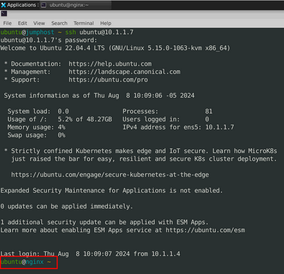
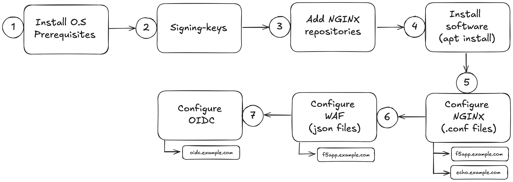
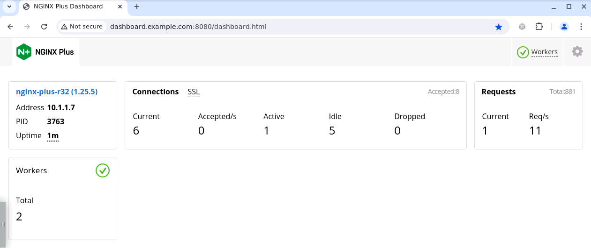
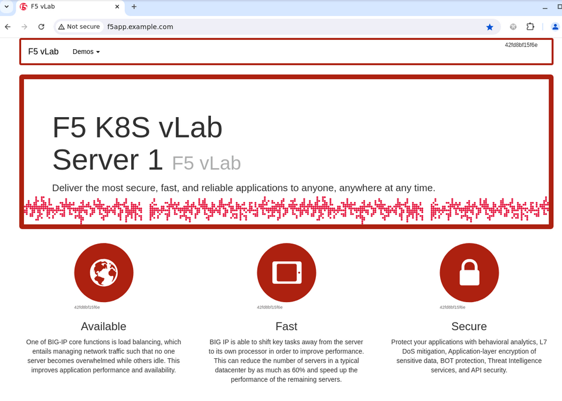
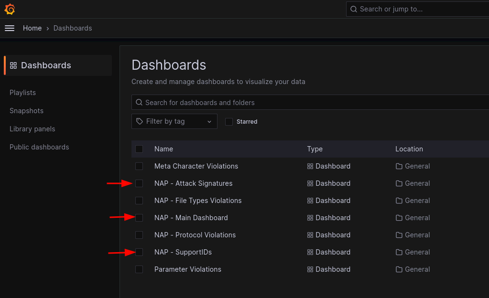

# NGINX Plus Lab 

## Content:
[1. NGINX Plus Installation](#1-nginx-plus-installation)\
[2. NGINX Base Configuration](#2-nginx-base-configuration)\
[3. Configuration Files](#3-configuration-files)\
  . [3.1 First App - f5app.example.com](#crear-configuración-de-la-primera-app---f5appexamplecom)\
  . [3.2 Second App - echo.example.com](#crear-configuración-de-la-segunda-app---echoexamplecom)\
[4. Web Application Firewall (WAF)](#4-web-application-firewall-waf)\
[5. OpenID Connect (OIDC) Auth](#5-auth-con-openid-connect-oidc)


## 1. NGINX Plus Installation
Note: Installation and configuration of NGINX Plus is done via command line and editing text configuration files.\
Some experience with the Linux CLI is recommended.

Throughout the guide, `vim` will be used to create and modify configuration files, however you can use any editor of your choice.

> [!NOTE]
> Remote Desktop and WebShell (UDF) can cause difficulties when copying and pasting text from configuration files. 
> 
> To create or edit NGINX configuration files with vscode, double-click the `nginx.code-workspace` shortcut on the Jumphost desktop and use the password `HelloUDF`
> 
> 
> 
> 
>
> 
> I case you need to reload NGINX configuration you can use the vscode terminal.
> 
> The rest of the instructions assume that you are editing files via the command line with `vim`.

> [!NOTE]
> <mark>IMPORTANT: All of the configuration steps are done in the `nginx` server \
>  Log-in with user `ubuntu` and password `HelloUDF`</mark>

Open a terminal and SSH to the `nginx` server:
```
ssh ubuntu@10.1.1.7
```
To validate we are in the correct server, chech the CLI prompt  `ubuntu@nginx ~`


This Lab steps can be summarized like this flow:

And those are the steps we will follow next:

- OS Pre-requisites:
  ```sh
  sudo apt-get install -y apt-transport-https lsb-release ca-certificates wget gnupg2 ubuntu-keyring
  ```
- Signing Keys:
  ```sh
  wget -qO - https://cs.nginx.com/static/keys/nginx_signing.key | gpg --dearmor | sudo tee /usr/share/keyrings/nginx-archive-keyring.gpg >/dev/null
  ```
  ```sh
  wget -qO - https://cs.nginx.com/static/keys/app-protect-security-updates.key | gpg --dearmor | sudo tee /usr/share/keyrings/app-protect-security-updates.gpg >/dev/null
- Add NGINX Repositories:
  ```sh
  printf "deb [signed-by=/usr/share/keyrings/nginx-archive-keyring.gpg] https://pkgs.nginx.com/plus/ubuntu `lsb_release -cs` nginx-plus\n" | sudo tee /etc/apt/sources.list.d/nginx-plus.list
  ```
  ```sh
  printf "deb [signed-by=/usr/share/keyrings/nginx-archive-keyring.gpg] https://pkgs.nginx.com/app-protect/ubuntu `lsb_release -cs` nginx-plus\n" | sudo tee /etc/apt/sources.list.d/nginx-app-protect.list
  ```
  ```sh
  printf "deb [signed-by=/usr/share/keyrings/app-protect-security-updates.gpg] https://pkgs.nginx.com/app-protect-security-updates/ubuntu `lsb_release -cs` nginx-plus\n" | sudo tee -a /etc/apt/sources.list.d/nginx-app-protect.list
  ```
  ```sh
  sudo wget -P /etc/apt/apt.conf.d https://cs.nginx.com/static/files/90pkgs-nginx
  ```
- Install packages:\
  NGINX Plus installation requires a certificate/key pair to authenticate into the F5/NGINX repositories and should be located in `/etc/ssl/nginx/nginx-repo.crt` & `/etc/ssl/nginx/nginx-repo.key` (This is already done)

  ```sh
  sudo apt update && sudo apt install -y nginx-plus app-protect nginx-plus-module-njs
  ```

  `nginx-plus` is NGINX Plus main package\
  `app-protect` is the WAF package\
  `nginx-plus-module-njs` is the NGINX JavaScript (NJS) package, and it is needed by the OIDC integration

- Enable NGINX at boot time and validate the install:
  ```sh
  sudo systemctl enable nginx
  sudo systemctl start nginx
  nginx -v
  ```
  ```
  curl http://0:80
  ```
  `nginx -v` Show NGINX version\
  `curl http://0:80` Returns the default NGINX web site

- Delete the "default site" config file, this one is not needed
  ```sh
  sudo rm /etc/nginx/conf.d/default.conf
  ```

## 2. NGINX Base Configuration
- Edit `/etc/nginx/nginx.conf` to add the WAF and NJS dynamic modules\
  `load_module modules/ngx_http_app_protect_module.so;`\
  `load_module modules/ngx_http_js_module.so;`\
  \
  Aditionaly, we need to configure 2 internal variables that are recommended when using NJS and OIDC integration\
  `variables_hash_max_size 2048;`\
  `variables_hash_bucket_size 128;`
  ```sh
  sudo vim /etc/nginx/nginx.conf
  ```
  The `nginx.conf` config file should look like this:
  ```nginx
  user  nginx;
  worker_processes  auto;

  error_log  /var/log/nginx/error.log notice;
  pid        /var/run/nginx.pid;

  load_module modules/ngx_http_app_protect_module.so;
  load_module modules/ngx_http_js_module.so;

  events {
      worker_connections  1024;
  }

  http {
      # Necesarias a la hora de configurar OIDC. Si no se incluyen, se va a presentar un Warning.
      variables_hash_max_size 2048;
      variables_hash_bucket_size 128;

      include       /etc/nginx/mime.types;
      default_type  application/octet-stream;

      log_format  main  '$remote_addr - $remote_user [$time_local] "$request" '
                        '$status $body_bytes_sent "$http_referer" '
                        '"$http_user_agent" "$http_x_forwarded_for"';

      access_log  /var/log/nginx/access.log  main;

      sendfile        on;
      #tcp_nopush     on;

      keepalive_timeout  65;

      #gzip  on;

      include /etc/nginx/conf.d/*.conf;
  }

  # TCP/UDP proxy and load balancing block
  #
  #stream {
      # Example configuration for TCP load balancing

      #upstream stream_backend {
      #    zone tcp_servers 64k;
      #    server backend1.example.com:12345;
      #    server backend2.example.com:12345;
      #}

      #server {
      #    listen 12345;
      #    status_zone tcp_server;
      #    proxy_pass stream_backend;
      #}
  #}

  # NGINX Plus Usage Reporting
  #
  # By default, every 30 minutes, NGINX Plus will send usage information
  # to NGINX Instance Manager, resolved by a "nginx-mgmt.local" DNS entry.
  # Alternate settings can be configured by uncommenting the "mgmt" block
  # and optional directives.
  #
  #mgmt {
      #usage_report endpoint=nginx-mgmt.local interval=30m;
      #resolver DNS_IP;

      #uuid_file /var/lib/nginx/nginx.id;

      #ssl_protocols TLSv1.2 TLSv1.3;
      #ssl_ciphers DEFAULT;

      #ssl_certificate          client.pem;
      #ssl_certificate_key      client.key;

      #ssl_trusted_certificate  trusted_ca_cert.crt;
      #ssl_verify               on;
      #ssl_verify_depth         2;
  #}
  ```

- Create the configuration to expose the NGINX Plus Dashboard and API endpoint. By default port 8080 is used.
  ```sh
  sudo vim /etc/nginx/conf.d/api.conf
  ```
  ```nginx
  server {
      listen 8080;
      access_log off; # reduce noise in access logs

      location /api/ {
          api write=on;
          #allow 127.0.0.1;
          #allow 192.168.0.0/20;
          allow 0.0.0.0/0;
          deny all;
      }

      # Conventional location of the NGINX Plus dashboard
      location = /dashboard.html {
          root /usr/share/nginx/html;
      }

      # Redirect requests for "/" to "/dashboard.html"
      location / {
          return 301 /dashboard.html;
      }

      # Enable Swagger UI
      location /swagger-ui {
          root   /usr/share/nginx/html;
      }
  }
  ```
- Reload NGINX configuration:
  ```sh
  sudo nginx -s reload
  ```
  Test from the browser - **http://dashboard.example.com:8080**

  
  The Dashboard is not showing much information yet, because there are no applications configured to be proxied by NGINX.
 ---
## 3. Configuration Files
It is recommended to create independant configuration files (one per site) with extension `.conf` and located inside the folder `/etc/nginx/conf.d/` and using a name related to the site/app to be exposed, example: `api.mysite.com.conf`. But any name with a `conf` extension will work.

- ### Create configuration for the first App - *f5app.example.com*
  ```sh
  sudo vim /etc/nginx/conf.d/f5app.example.com.conf
  ```
  The file `f5app.example.com.conf` should look like this:
  ```nginx
  # Custom Health Check
  match f5app_health {
      status 200;
      body ~ "F5 K8S vLab";
  }

  server {
      listen 80 default_server;
      server_name www.example.com;
      status_zone www.example.com_http;

      location / {
          # Active Health Check
          health_check match=f5app_health interval=10 fails=3 passes=2 uri=/;

          proxy_pass http://f5app-backend;
      }
  }

  upstream f5app-backend {
      # Load Balancing Algorithm, Default = RoundRobin
      # random;
      keepalive 16;
      zone backend 64k;
      server 10.1.1.6:8080;
      #server 10.1.1.6:8090;
      #sticky cookie helloworld expires=1h domain=.example.com path=/;  ## SESSION PERSISTENCE
  }
  ```
  Reload NGINX configuration:
  ```sh
  sudo nginx -s reload
  ```

  Test from the browser - **http://f5app.example.com**

  

  This application is being exposed through the reverse-proxy, but it is not protected: 
  - Go to Demos > Credit Cards :arrow_right: Note that the server is exposing sensitive information (credit card numbers).
  - Run a XSS - `http://f5app.example.com/<script>Danger!</script>` (The App return a 404 Not Found, however the server processes the request)

  Validate in the NGINX Plus Dashboard, now we can see information from f5app, metrics, health state and monitores - **http://dashboard.example.com:8080**

  Now, let's modify the Heath-Check configuration:
  ```sh
  sudo vim /etc/nginx/conf.d/f5app.example.com.conf
  ```
  We must change the block `match f5app_health` like this: 
  ```
  match f5app_health {
      status 200;
      body ~ "Workshop K8S vLab";
  }
  ```
  The Body section now contains a string that the server's answer do not contain.
  Reload the configuration with `sudo nginx -s reload` y test the application again.
  

  **What is happening?** The App does not work, this is expected, and the answer from NGINX is `502 Bad Gateway` because there are no healthy upstreams (The string **"Workshop K8S vLab** is not found in the reponse body)


  In the NGINX Plus Dashboard we can see the number of successful healthchecks and the upstream health.
  

  > [!NOTE]
  > ### <mark>**Please reverse the changes to the health check (body = F5 K8S vLab) and reload NGINX configuration before continuing with the lab**</mark>
    ```
  match f5app_health {
      status 200;
      body ~ "F5 K8S vLab";
  }
  ```
  #### Load Balancing:

  In the next step we are going to configure Load Balancing.
  To do this, remove the comment `#` from the second `server` inside the block `upstream f5app-backend`, towards the end of the file. Finally reload NGINX configuration. 
  
  The default Load Balancing method is Round Robin.

  Test from the browser - **http://f5app.example.com**. Note how the app now is pulling content from 2 different upstream servers (in 2 different colors). If you check the NGINX Plus Dashboad now there are 2 upstream servers in the f5app application.

- ### Create configuration for the second App - *echo.example.com*
  ```sh
  sudo vim /etc/nginx/conf.d/echo.example.com.conf
  ```
  The configuration file `echo.example.com.conf` should loook like this:
  ```nginx
  server {
      listen 443 ssl;
      server_name echo.example.com;
      status_zone echo.example.com_http;

      ssl_certificate /etc/ssl/nginx/echo.example.com.crt;
      ssl_certificate_key /etc/ssl/nginx/echo.example.com.key;
      ssl_ciphers TLS_AES_256_GCM_SHA384:HIGH:!aNULL:!MD5;
      ssl_prefer_server_ciphers on;

      location / {
          proxy_pass http://10.1.1.6:8081;
      }
  }
  ```
  Note in the configuration how this second application is using TLS termination in the NGINX proxy. Another thing to notice is that there is no `upstream` block in the configureation, and the traffic is being proxied directly to an existing backend and is not doing Load Balancing.

Reload NGINX configuration:
  ```sh
  sudo nginx -s reload
  ```

  Test from the browser - **https://echo.example.com**

  This is a simple application that show information from the request (including Headers) in JSON format.

  

  Now let's configure *"header insertion"*, we should be able to see the new injected headers in the "echo" application..

  ```
  sudo vim /etc/nginx/conf.d/echo.example.com.conf
  ```
  Add this directives to the existing configuration inside the `location /` block:
  ```
  add_header X-ServerIP $server_addr;
  add_header X-srv-hostname $hostname;

  proxy_set_header X-Client-IP $remote_addr;
  proxy_set_header X-Hola "Mundo";
  ```

  The configuration file `echo.example.com.conf` should look like this:
  ```nginx
  server {
      listen 443 ssl;
      server_name echo.example.com;
      status_zone echo.example.com_http;

      ssl_certificate /etc/ssl/nginx/echo.example.com.crt;
      ssl_certificate_key /etc/ssl/nginx/echo.example.com.key;
      ssl_ciphers TLS_AES_256_GCM_SHA384:HIGH:!aNULL:!MD5;
      ssl_prefer_server_ciphers on;

      location / {
          add_header X-ServerIP $server_addr;
          add_header X-srv-hostname $hostname;

          proxy_set_header X-Client-IP $remote_addr;
          proxy_set_header X-Hola "Mundo";

          proxy_pass http://10.1.1.6:8081;
      }
  }
  ```
  `add_header` Adds a header to server's response\
  `proxy_set_header` Adds a header to the customer request before sending to the upstream/backend server\
  
  The parameters `$server_addr`, `$hostname`, `$remote_addr` are internal NGINX variables. The full list of variables used by NGNIX is in the documentation - **http://nginx.org/en/docs/http/ngx_http_core_module.html#variables** 

  **NOTE:** Reponse headers (add_header) can be seen using the Browser's Developer Tools.

---

## 4. Web Application Firewall (WAF)
NGINX App Protect (v4) utiliza archivos en formato JSON para la definición de la política de seguridad declarativa. Estos archivos pueden estar en cualquier ubicación en el filesystem, para este Lab los colocaremos en la ruta `/etc/nginx/waf/`

También es posible tener la política como un archivo binario llamado "policy bundle" que se compila por medio de un software llamado [NGINX App Protect Policy Compiler](https://docs.nginx.com/nginx-app-protect-waf/v5/admin-guide/compiler/), pero para este Lab usaremos los archivos JSON

La política de seguridad que usaremos se compone de:
- Un archivo JSON con la configuración del formato del log del WAF
- Un archivo JSON con la política base, el cual se referencia desde `nginx.conf`
- Archivos JSON con referencias a varios bloques de configuración (opcionales), en nuestro caso tenemos:
  - JSON para definición de "Server Technologies" usadas en el App a proteger
  - JSON con lista blanca de direcciones IP a los cuales no se le aplica validación por parte del WAF
  -  JSON con violaciones especificas a nivel protocolo HTTP
  -  JSON con violaciones tipo Evasión

Ahora procederemos a crear todos los archivos de configuración del WAF y activarlo para una de las aplicaciones desplegadas en un paso anterior

-  Crear archivo de log profile en `/etc/nginx/waf/`
   ```sh
   sudo mkdir /etc/nginx/waf
   sudo vim /etc/nginx/waf/log-grafana.json
   ```
   Este archivo usa un formato de log especifico para un dashboard de Grafana.\
   Existe un formato `default` orientado a logs básicos via syslog y otros formatos predefinidos como `big-iq`, `arcsight`, `grpc`, `splunk` y `user-defined` que es el utilizado en este Lab.
   ```json
   {
     "filter": {
       "request_type": "illegal"
     },
     "content": {
       "format": "user-defined",
       "format_string": "{\"campaign_names\":\"%threat_campaign_names%\",\"bot_signature_name\":\"%bot_signature_name%\",\"bot_category\":\"%bot_category%\",\"bot_anomalies\":\"%bot_anomalies%\",\"enforced_bot_anomalies\":\"%enforced_bot_anomalies%\",\"client_class\":\"%client_class%\",\"client_application\":\"%client_application%\",\"json_log\":%json_log%}",
       "max_request_size": "500",
       "max_message_size": "30k",
       "escaping_characters": [
         {
           "from": "%22%22",
           "to": "%22"
         }
       ]
     }
   }
   ```
- Crear archivo de la política de seguridad base en `/etc/nginx/waf/`
   ```sh
   sudo vim /etc/nginx/waf/NginxCustomPolicy.json
   ```
   ```json
   {
       "policy": {
           "name": "NGINX_Base_with_modifications",
           "template": { "name": "POLICY_TEMPLATE_NGINX_BASE" },
           "applicationLanguage": "utf-8",
           "enforcementMode": "blocking",
           "blocking-settings": {
              "violations": [
                  {
                      "name": "VIOL_RATING_THREAT",
                      "alarm": true,
                      "block": true
                  },
                  {
                      "name": "VIOL_RATING_NEED_EXAMINATION",
                      "alarm": false,
                      "block": false
                  },
                  {
                      "name": "VIOL_THREAT_CAMPAIGN",
                      "alarm": true,
                      "block": true
                  },
                  {
                      "name": "VIOL_FILETYPE",
                      "alarm": true,
                      "block": true
                  },
                  {
                       "name": "VIOL_EVASION",
                       "alarm": true,
                       "block": true
                   },
                   {
                       "name": "VIOL_METHOD",
                       "alarm": true,
                       "block": true
                   },
                   {
                       "name": "VIOL_HTTP_PROTOCOL",
                       "alarm": false,
                       "block": false
                   },
                   {
                       "name": "VIOL_DATA_GUARD",
                       "alarm": false,
                       "block": false
                   },
                   {
                       "name": "VIOL_HTTP_RESPONSE_STATUS",
                       "alarm": true,
                       "block": true
                   },
                   {
                       "name": "VIOL_BLACKLISTED_IP",
                       "alarm": true,
                       "block": true
                   }
              ],
              "httpProtocolReference": {
                   "link": "file:///etc/nginx/waf/http-protocols.json"
              },
              "evasionReference": {
                  "link": "file:///etc/nginx/waf/evasions.json"
              }
           },
           "general": {
               "allowedResponseCodes": [
                   400,
                   401,
                   403,
                   404,
                   502
               ],
               "trustXff": true
           },
           "header-settings": {
               "maximumHttpHeaderLength": 4096
           },
           "serverTechnologyReference": {
               "link": "file:///etc/nginx/waf/server-technologies.json"
           },
           "responsePageReference": {
               "link": "https://raw.githubusercontent.com/cavalen/acme/master/response-pages-v2.json"
           },
           "whitelistIpReference": {
               "link": "file:///etc/nginx/waf/whitelist-ips.json"
           },
           "data-guard": {
               "enabled": true,
               "maskData": true,
               "creditCardNumbers": true,
               "usSocialSecurityNumbers": true,
               "enforcementMode": "ignore-urls-in-list",
               "enforcementUrls": [],
               "lastCcnDigitsToExpose": 4,
               "lastSsnDigitsToExpose": 4
           }
       }
   }
   ```
   Si revisamos la estructura del archivo podemos ver los diferentes bloques de configuración, como las violaciones, el modo de bloqueo (Blocking / Transparent), DataGuard (Validar data sensible expuesta por el servidor), response Pages (Pagina de respuesta a Violaciones), Códigos de respuesta HTTP validos y algunos otras configuraciones que se encuentran en la [documentación de la política declarativa de NGINX App Protect]( https://docs.nginx.com/nginx-app-protect-waf/v4/declarative-policy/policy/)\
   **https://docs.nginx.com/nginx-app-protect-waf/v4/declarative-policy/policy/**

- Crear archivo de definición de "Server Technologies" para la política de seguridad en `/etc/nginx/waf/`
   ```sh
   sudo vim /etc/nginx/waf/server-technologies.json
   ```
   ```json
   [
     {
       "serverTechnologyName": "MySQL"
     },
     {
       "serverTechnologyName": "Unix/Linux"
     },
     {
       "serverTechnologyName": "Node.js"
     },
     {
       "serverTechnologyName": "Nginx"
     }
   ]
   ```
- Crear archivo de definición de "IP Whitelist" para la política de seguridad en `/etc/nginx/waf/`
   ```sh
   sudo vim /etc/nginx/waf/whitelist-ips.json
   ```
   ```json
   [
       {
           "blockRequests": "never",
           "neverLogRequests": false,
           "ipAddress": "1.1.1.1",
           "ipMask": "255.255.255.255"
       },
       {
           "blockRequests": "always",
           "ipAddress": "2.2.2.2",
           "ipMask": "255.255.255.255"
       },
       {
           "blockRequests": "never",
           "neverLogRequests": false,
           "ipAddress": "3.3.3.0",
           "ipMask": "255.255.255.0"
       },
       {
           "blockRequests": "always",
           "neverLogRequests": false,
           "ipAddress": "180.18.19.20",
           "ipMask": "255.255.255.255"
       }
   ]
   ```
- Crear archivo de definición de "HTTP Protocol Compliance" para la política de seguridad en `/etc/nginx/waf/`
   ```sh
   sudo vim /etc/nginx/waf/http-protocols.json
   ```
   ```json
   [
       {
           "description": "Header name with no header value",
           "enabled": true
       },
       {
           "description": "Chunked request with Content-Length header",
           "enabled": true
       },
       {
           "description": "Check maximum number of parameters",
           "enabled": true,
           "maxParams": 5
       },
       {
           "description": "Check maximum number of headers",
           "enabled": true,
           "maxHeaders": 20
       },
       {
           "description": "Body in GET or HEAD requests",
           "enabled": true
       },
       {
           "description": "Bad multipart/form-data request parsing",
           "enabled": true
       },
       {
           "description": "Bad multipart parameters parsing",
           "enabled": true
       },
       {
           "description": "Unescaped space in URL",
           "enabled": true
       },
       {
           "description": "Host header contains IP address",
           "enabled": false
       }
   ]
   ```
- Crear archivo de definición de "Técnicas de Evasion" para la política de seguridad en `/etc/nginx/waf/`
   ```sh
   sudo vim /etc/nginx/waf/evasions.json
   ```
   ```json
   [
       {
           "description": "Bad unescape",
           "enabled": true
       },
       {
           "description": "Directory traversals",
           "enabled": true
       },
       {
           "description": "Bare byte decoding",
           "enabled": true
       },
       {
           "description": "Apache whitespace",
           "enabled": false
       },
       {
           "description": "Multiple decoding",
           "enabled": true,
           "maxDecodingPasses": 2
       },
       {
           "description": "IIS Unicode codepoints",
           "enabled": true
       },
       {
           "description": "IIS backslashes",
           "enabled": true
       },
       {
           "description": "%u decoding",
           "enabled": true
       }
   ]
   ```
- Como ultimo paso, activamos el WAF para la aplicación `f5app`, editando el archivo `/etc/nginx/conf.d/f5app.example.com.conf`

   Las configuraciones a nivel WAF adicionan a nivel de la directiva `server {}` de forma "global" (para toda la aplicación f5app) o en un `location` especifico. En este caso lo hacemos para toda la aplicación.

   Como requisito, el modulo de WAF debe estar cargado a NGINX, esto lo hicimos en un paso anterior agregando la directiva `load_module` en `nginx.conf`

   `app_protect_enable on;` Activa el WAF.\
   `app_protect_security_log_enable on;` Activa logs para el WAF.\
   `app_protect_security_log "/etc/nginx/waf/log-grafana.json" syslog:server=grafana.example.com:8515;` Indica el formato a usar para los logs de WAF y el destino. Puede usarse multiples veces para hacer logs a varios destinos.\
   `app_protect_policy_file "/etc/nginx/waf/NginxCustomPolicy.json";` Indica la politica de WAF a usar.

   Las lineas que se adicionan a la configuracion en el bloque `server` son:
   ```
   app_protect_enable on;
   app_protect_security_log_enable on;
   app_protect_security_log "/etc/nginx/waf/log-grafana.json" syslog:server=grafana.example.com:8515;
   app_protect_policy_file "/etc/nginx/waf/NginxCustomPolicy.json";
   ```
   ```
   sudo vim /etc/nginx/conf.d/f5app.example.com.conf
   ```

   El archivo `f5app.example.com.conf` queda de la siguiente manera:
   ```nginx
   # Custom Health Check
   match f5app_health {
       status 200;
       body ~ "F5 K8S vLab";
   }

   server {
       listen 80 default_server;
       server_name f5app.example.com;
       status_zone f5app.example.com_http;

       app_protect_enable on;
       app_protect_security_log_enable on;
       app_protect_security_log "/etc/nginx/waf/log-grafana.json" syslog:server=grafana.example.com:8515;
       app_protect_policy_file "/etc/nginx/waf/NginxCustomPolicy.json";

       location / {
           # Active Health Check
           health_check match=f5app_health interval=10 fails=3 passes=2 uri=/;
           proxy_pass http://f5app-backend;
       }
   }

   upstream f5app-backend {
       # Load Balancing Algorithm, Default = RoundRobin
       # random;
       keepalive 16;
       zone backend 64k;
       server 10.1.1.6:8080;
       server 10.1.1.6:8090;
       #sticky cookie helloworld expires=1h domain=.example.com path=/;  ## SESSION PERSISTENCE
   }
   ```

  Recargar la configuración de nginx:
  ```
  sudo nginx -s reload
  ```
  Validar configuración:
  ```
  sudo nginx -t
  ```

  Probar desde el browser **http://f5app.example.com**

  Hacer algunas simulaciones de ataques a la aplicación, <mark>y tomar nota del SupportID</mark>
    - Adicionar al path un XSS `http://f5app.example.com/<script>Danger!</script>`
    - Adicionar al path un SQLi `http://f5app.example.com/?a='or 1=1#'`
    - Navegar en la aplicacion al menu Demos > CC Numbers y validar que la configuración de DataGuard ofusca información sensible.

  En Grafana validar logs del WAF:\
  Ir a **http://grafana.example.com:3000** y ver los Dashboards Attack Signatures, Main Dashboard y SupportIDs\
  

  

## 5. Auth con OpenID Connect (OIDC)
NGINX Plus permite utilizar un Identity Provider (IdP) para autenticar usuarios antes de "proxearlos" hacia la aplicación o el backend.\
Esta integración es un proceso manual y se realiza por medio de un componente adicional que debe ser descargado y configurado.


`Figura 1. Componentes a Alto nivel de un entorno de OpenID Connect`

Esta implementación asume lo siguiente del entorno:
  * El identity provider (IdP) soportas OpenID Connect 1.0
  * El "authorization code flow" esta en uso
  * NGINX Plus esta configurado como un Relying Party
  * El IdP conoce a NGINX Plus como un cliente confidentialnt o un cliente publico usando PKCE

Con este entorno, tanto el client como NGINX Plus se comunican directamente con el IdP en diferentes momentos durante el proceso de autenticación.


`Figura 2. Flujo de autorización de OpenID Connect`

El laboratorio cuenta con un despliegue de `Keycloak` usado como Identity Provider (IdP) el cual valida las credenciales del usuario.

Ya esta pre-configurado, y se puede acceder via **https://keycloak.example.com** con las credenciales `admin/admin` y en este hay un client llamado `nginx-plus` y un usuario `test` con password `test`

| Client                        | User                          |
|-------------------------------|-------------------------------|
|  |  |

- La configuración a grandes rasgos consta de 5 pasos:
   1. Descargar el software necesario para la integración de OIDC desde GitHub
   2. Ejecutar un script de configuración via linea de comandos
   3. Validar la configuración generada por el script (Datos y rutas del Identity Provider)
   4. Copiar la configuración generada por el script a la misma ruta donde se encuentra el archivo de configuración de la aplicación a la que queremos integrar autenticación (generalmente `/etc/nginx/conf.d`)
   5. Editar la configuración del aplicativo (`/etc/nginx/conf.d/<nombre-app>.conf`) y adicionar las directivas generadas por el script.

- Crear un nuevo "sitio" al cual habilitar autenticación por medio de OIDC
  ```
  sudo vim /etc/nginx/conf.d/oidc.example.com.conf
  ```
  ```nginx
  server {
      listen 443 ssl;
      server_name oidc.example.com;
      status_zone oidc.example.com_http;

      ssl_certificate /etc/ssl/nginx/oidc.example.com.crt;
      ssl_certificate_key /etc/ssl/nginx/oidc.example.com.key;
      ssl_ciphers TLS_AES_256_GCM_SHA384:HIGH:!aNULL:!MD5;
      ssl_prefer_server_ciphers on;

      location / {
          add_header X-ServerIP $server_addr;
          add_header X-srv-hostname $hostname;

          proxy_set_header X-Client-IP $remote_addr;
          proxy_set_header X-Hola "Mundo";

          proxy_pass http://10.1.1.6:8081;
      }
  }
  ```
  ```
  sudo nginx -s reload
  ```

- Descargar el software desde GitHub.\
  Hay un branch recomendado para cada version de NGINX Plus, por ejemplo para NGINX Plus R31 el comando git debe especificar el branch adecuado (ej, `git clone -b R31 <REPO>`)\
En este caso descargaremos la ultima version (latest)
  ```sh
  git clone https://github.com/nginxinc/nginx-openid-connect
  ```
  ```sh
  cd nginx-openid-connect
  ```
  ```sh
  ./configure.sh -x -h oidc.example.com -k request -i nginx-plus -s 1234567890ABCDEF http://keycloak.example.com/realms/master/.well-known/openid-configuration
  ```
  `-h` indica el FQDN del IdP\
  `-x` Insecure, no valida el certificado HTTPS (OK para entornos de prueba)\
  `-i nginx-plus` Client ID tal como esta configurado en el OpenID Connect Provider\
  `-s 1234567890ABCDEF` Client Secret tal como esta configurado en el OpenID Connect Provider\
  `http://keycloak.example.com/realms/master/.well-known/openid-configuration` Discovery interface del IdP.

- Configurar Parámetros de OIDC (1)

  El script crea varios archivos, el primero a editar es `openid_connect_configuration.conf`

  Solo es necesario editar la directiva `resolver` al comienzo del archivo.\
  Como estamos usando el dominio de pruebas `example.com` este no resuelve con el DNS publico por defecto que utiliza el script (8.8.8.8) y debemos indicar la dirección IP del servicio DNS interno `127.0.0.53`.

  ```sh
  sudo vim openid_connect.server_conf
  ```
  El archivo final `openid_connect.server_conf` queda asi:
  ```nginx
      # Advanced configuration START
    set $internal_error_message "NGINX / OpenID Connect login failure\n";
    set $pkce_id "";
    resolver 127.0.0.53; # For DNS lookup of IdP endpoints;
    subrequest_output_buffer_size 32k; # To fit a complete tokenset response
    gunzip on; # Decompress IdP responses if necessary
    # Advanced configuration END

    location = /_jwks_uri {
        internal;
        proxy_cache jwk;                              # Cache the JWK Set received from IdP
        proxy_cache_valid 200 12h;                    # How long to consider keys "fresh"
        proxy_cache_use_stale error timeout updating; # Use old JWK Set if cannot reach IdP
        proxy_ssl_server_name on;                     # For SNI to the IdP
        proxy_method GET;                             # In case client request was non-GET
        proxy_set_header Content-Length "";           # ''
        proxy_pass $oidc_jwt_keyfile;                 # Expecting to find a URI here
        proxy_ignore_headers Cache-Control Expires Set-Cookie; # Does not influence caching
    }

    location @do_oidc_flow {
        status_zone "OIDC start";
        js_content oidc.auth;
        default_type text/plain; # In case we throw an error
    }

    set $redir_location "/_codexch";
    location = /_codexch {
        # This location is called by the IdP after successful authentication
        status_zone "OIDC code exchange";
        js_content oidc.codeExchange;
        error_page 500 502 504 @oidc_error;
    }

    location = /_token {
        # This location is called by oidcCodeExchange(). We use the proxy_ directives
        # to construct the OpenID Connect token request, as per:
        #  http://openid.net/specs/openid-connect-core-1_0.html#TokenRequest
        internal;
        proxy_ssl_server_name on; # For SNI to the IdP
        proxy_set_header      Content-Type "application/x-www-form-urlencoded";
        proxy_set_header      Authorization $arg_secret_basic;
        proxy_pass            $oidc_token_endpoint;
   }

    location = /_refresh {
        # This location is called by oidcAuth() when performing a token refresh. We
        # use the proxy_ directives to construct the OpenID Connect token request, as per:
        #  https://openid.net/specs/openid-connect-core-1_0.html#RefreshingAccessToken
        internal;
        proxy_ssl_server_name on; # For SNI to the IdP
        proxy_set_header      Content-Type "application/x-www-form-urlencoded";
        proxy_set_header      Authorization $arg_secret_basic;
        proxy_pass            $oidc_token_endpoint;
    }

    location = /_id_token_validation {
        # This location is called by oidcCodeExchange() and oidcRefreshRequest(). We use
        # the auth_jwt_module to validate the OpenID Connect token response, as per:
        #  https://openid.net/specs/openid-connect-core-1_0.html#IDTokenValidation
        internal;
        auth_jwt "" token=$arg_token;
        js_content oidc.validateIdToken;
        error_page 500 502 504 @oidc_error;
    }

    location = /logout {
        status_zone "OIDC logout";
        add_header Set-Cookie "auth_token=; $oidc_cookie_flags";
        add_header Set-Cookie "auth_nonce=; $oidc_cookie_flags";
        add_header Set-Cookie "auth_redir=; $oidc_cookie_flags";
        js_content oidc.logout;
    }

    location = /_logout {
        # This location is the default value of $oidc_logout_redirect (in case it wasn't configured)
        default_type text/plain;
        return 200 "Logged out\n";
    }

    location @oidc_error {
        # This location is called when oidcAuth() or oidcCodeExchange() returns an error
        status_zone "OIDC error";
        default_type text/plain;
        return 500 $internal_error_message;
    }

    location /api/ {
        api write=on;
        allow 127.0.0.1; # Only the NGINX host may call the NGINX Plus API
        deny all;
        access_log off;
    }

    # vim: syntax=nginx
    ```

- Configurar Parámetros de OIDC (2)

  El segundo archivo a configurar es `openid_connect_configuration.conf`.
  Debemos validar que el contenido del archivo sea el correcto respecto a los endpoints de OIDC de Keycloak.

  El administrador de Identity Provider debe conocer estos valores, adicionalmente el URL de `openid-configurations` nos puede ayudar en esta validación:

  **http://keycloak.example.com/realms/master/.well-known/openid-configuration**
  
  

  Los valores importantes a configurar están en las directivas `map` del archivo
  | Parámetro | Valor |
  |-----------|-------|
  | `$oidc_authz_endpoint` | `oidc.example.com https://keycloak.example.com/realms/master/protocol/openid-connect/auth;` |
  | `$oidc_token_endpoint` | `oidc.example.com https://keycloak.example.com/realms/master/protocol/openid-connect/token;` |
  | `$oidc_jwt_keyfile` | `oidc.example.com https://keycloak.example.com/realms/master/protocol/openid-connect/certs;` |
  | `$host $oidc_client` | `oidc.example.com nginx-plus;` |
  | `$oidc_client_secret` | `oidc.example.com 1234567890ABCDEF;` |

  ```sh
  sudo vim openid_connect_configuration.conf
  ```
  El archivo final `openid_connect_configuration.conf` queda asi:
  ```nginx
  # OpenID Connect configuration
  #
  # Each map block allows multiple values so that multiple IdPs can be supported,
  # the $host variable is used as the default input parameter but can be changed.
  #
  map $host $oidc_authz_endpoint {
      oidc.example.com https://keycloak.example.com/realms/master/protocol/openid-connect/auth;

      default "http://127.0.0.1:8080/auth/realms/master/protocol/openid-connect/auth";
      #www.example.com "https://my-idp/oauth2/v1/authorize";
  }

  map $host $oidc_authz_extra_args {
      # Extra arguments to include in the request to the IdP's authorization
      # endpoint.
      # Some IdPs provide extended capabilities controlled by extra arguments,
      # for example Keycloak can select an IdP to delegate to via the
      # "kc_idp_hint" argument.
      # Arguments must be expressed as query string parameters and URL-encoded
      # if required.
      default "";
      #www.example.com "kc_idp_hint=another_provider"
  }

  map $host $oidc_token_endpoint {
      oidc.example.com https://keycloak.example.com/realms/master/protocol/openid-connect/token;

      default "http://127.0.0.1:8080/auth/realms/master/protocol/openid-connect/token";
  }

  map $host $oidc_jwt_keyfile {
      oidc.example.com https://keycloak.example.com/realms/master/protocol/openid-connect/certs;

      default "http://127.0.0.1:8080/auth/realms/master/protocol/openid-connect/certs";
  }

  map $host $oidc_end_session_endpoint {
      oidc.example.com https://keycloak.example.com/realms/master/protocol/openid-connect/certs;


      # Specifies the end_session_endpoint URL for RP-initiated logout.
      # If this variable is empty or not set, the default behavior is maintained,
      # which logs out only on the NGINX side.
      default "";
  }

  map $host $oidc_client {
      oidc.example.com nginx-plus;

      default "my-client-id";
  }

  map $host $oidc_pkce_enable {
      default 0;
  }

  map $host $oidc_client_secret {
      oidc.example.com 1234567890ABCDEF;


      default "my-client-secret";
  }

  map $host $oidc_client_auth_method {
      # Choose either "client_secret_basic" for sending client credentials in the
      # Authorization header, or "client_secret_post" for sending them in the
      # body of the POST request. This setting is used for confidential clients.
      default "client_secret_post";
  }

  map $host $oidc_scopes {
      default "openid+profile+email+offline_access";
  }

  map $host $oidc_logout_redirect {
      # Where to send browser after requesting /logout location. This can be
      # replaced with a custom logout page, or complete URL.
      default "/_logout"; # Built-in, simple logout page
  }

  map $host $oidc_hmac_key {
      oidc.example.com MPjqIKKjiKExZPKj3B7Q4xCV;

      # This should be unique for every NGINX instance/cluster
      default "ChangeMe";
  }

  map $host $zone_sync_leeway {
      # Specifies the maximum timeout for synchronizing ID tokens between cluster
      # nodes when you use shared memory zone content sync. This option is only
      # recommended for scenarios where cluster nodes can randomly process
      # requests from user agents and there may be a situation where node "A"
      # successfully received a token, and node "B" receives the next request in
      # less than zone_sync_interval.
      default 0; # Time in milliseconds, e.g. (zone_sync_interval * 2 * 1000)
  }

  map $proto $oidc_cookie_flags {
      http  "Path=/; SameSite=lax;"; # For HTTP/plaintext testing
      https "Path=/; SameSite=lax; HttpOnly; Secure;"; # Production recommendation
  }

  map $http_x_forwarded_port $redirect_base {
      ""      $proto://$host:$server_port;
      default $proto://$host:$http_x_forwarded_port;
  }

  map $http_x_forwarded_proto $proto {
      ""      $scheme;
      default $http_x_forwarded_proto;
  }

  # ADVANCED CONFIGURATION BELOW THIS LINE
  # Additional advanced configuration (server context) in openid_connect.server_conf

  # JWK Set will be fetched from $oidc_jwks_uri and cached here - ensure writable by nginx user
  proxy_cache_path /var/cache/nginx/jwk levels=1 keys_zone=jwk:64k max_size=1m;

  # Change timeout values to at least the validity period of each token type
  keyval_zone zone=oidc_id_tokens:1M     state=/var/lib/nginx/state/oidc_id_tokens.json     timeout=1h;
  keyval_zone zone=oidc_access_tokens:1M state=/var/lib/nginx/state/oidc_access_tokens.json timeout=1h;
  keyval_zone zone=refresh_tokens:1M     state=/var/lib/nginx/state/refresh_tokens.json     timeout=8h;
  keyval_zone zone=oidc_pkce:128K timeout=90s; # Temporary storage for PKCE code verifier.

  keyval $cookie_auth_token $session_jwt   zone=oidc_id_tokens;     # Exchange cookie for JWT
  keyval $cookie_auth_token $access_token  zone=oidc_access_tokens; # Exchange cookie for access token
  keyval $cookie_auth_token $refresh_token zone=refresh_tokens;     # Exchange cookie for refresh token
  keyval $request_id $new_session          zone=oidc_id_tokens;     # For initial session creation
  keyval $request_id $new_access_token     zone=oidc_access_tokens;
  keyval $request_id $new_refresh          zone=refresh_tokens; # ''
  keyval $pkce_id $pkce_code_verifier      zone=oidc_pkce;

  auth_jwt_claim_set $jwt_audience aud; # In case aud is an array
  js_import oidc from conf.d/openid_connect.js;

  # vim: syntax=nginx
  ```
- Copiar archivos generados por el script a la carpeta de nginx, donde están la configuración de la app a la que vamos a integrar autenticación.
  ```sh
  sudo cp openid_connect* /etc/nginx/conf.d/
  ```
- Editar aplicación Web para integrar OIDC

  En uno de los primeros pasos de la configuración de OIDC, creamos un archivo para el sitio `oidc.example.com`. Ahora debemos editarlo para incluir lo que el script de configuración creo y lo que hemos editado de forma manual.

  El script crea un archivo llamado `frontend.conf`, este archivo no es necesario, pero muestra las directivas que debe tener una aplicación para hacer la integración de OIDC y se usa como ejemplo de configuración.

  ```sh
  sudo vim /etc/nginx/conf.d/oidc.example.com.conf
  ```
  ```nginx
  # Custom log format to include the 'sub' claim in the REMOTE_USER field
  log_format main_jwt '$remote_addr - $jwt_claim_sub [$time_local] "$request" $status '
                      '$body_bytes_sent "$http_referer" "$http_user_agent" "$http_x_forwarded_for"';
  server {
      include conf.d/openid_connect.server_conf; # Authorization code flow and Relying Party processing
      error_log /var/log/nginx/error.log debug;  # Reduce severity level as required

      listen 443 ssl;
      server_name oidc.example.com;
      status_zone oidc.example.com_http;

      ssl_certificate /etc/ssl/nginx/oidc.example.com.crt;
      ssl_certificate_key /etc/ssl/nginx/oidc.example.com.key;
      ssl_ciphers TLS_AES_256_GCM_SHA384:HIGH:!aNULL:!MD5;
      ssl_prefer_server_ciphers on;

      location / {
          # This site is protected with OpenID Connect
          auth_jwt "" token=$session_jwt;
          error_page 401 = @do_oidc_flow;

          #auth_jwt_key_file $oidc_jwt_keyfile; # Enable when using filename
          auth_jwt_key_request /_jwks_uri; # Enable when using URL

          # Successfully authenticated users are proxied to the backend,
          # with 'sub' claim passed as HTTP header
          proxy_set_header username $jwt_claim_sub;

          # Bearer token is uses to authorize NGINX to access protected backend
          proxy_set_header Authorization "Bearer $access_token";
          # Intercept and redirect "401 Unauthorized" proxied responses to nginx
          # for processing with the error_page directive. Necessary if Access Token
          # can expire before ID Token.
          #proxy_intercept_errors on;

          add_header X-ServerIP $server_addr;
          add_header X-srv-hostname $hostname;

          proxy_set_header X-Client-IP $remote_addr;
          proxy_set_header X-Hola "Mundo";

          proxy_pass http://10.1.1.6:8081;

          access_log /var/log/nginx/access.log main_jwt;
      }
  }
  ```
  Recargamos la configuración de Nginx.
  ```sh
  sudo nginx -s reload
  ```
  Validamos en un browser en **https://oidc.example.com**

  La aplicación debe ahora solicitar credenciales a Keycloak antes de permitir acceso a la App. Usar `test:test`
  |                               |                               |
  |-------------------------------|-------------------------------|
  |  |  |

### -FIN-
