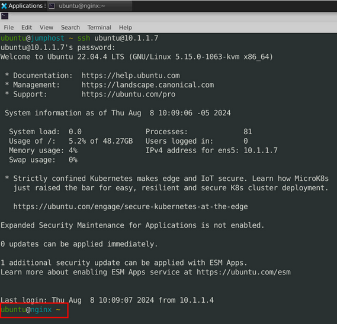
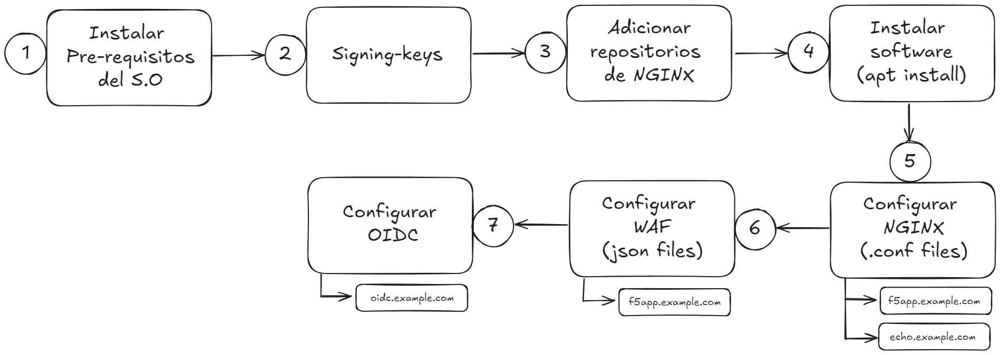
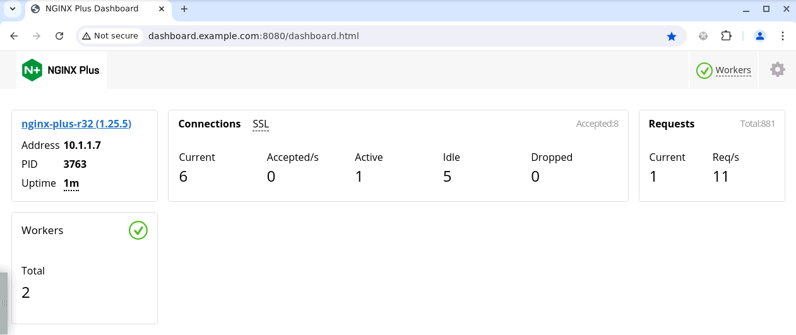
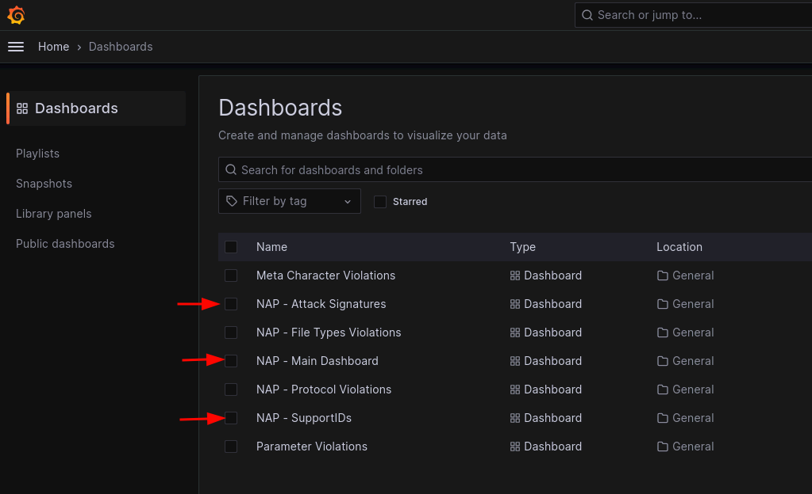

# Instrucciones Lab NGINX Plus

### 1. Instalación Nginx Plus
Nota: La instalacion y la configuracion de NGINX Plus se realizar por linea de comandos y editando archivos de configuracion de texto.\
Se recomienda tener alguna experiencia en el CLI de Linux.

En la guia se utilizará `vim` para crear y modificar los archivos de configuración, sin embargo el editor de su preferencia puede ser utilizado.

<mark>IMPORTANTE: Los pasos de configuracion de esta guia se hacen sobre el servidor `nginx`\
Usuario `ubuntu` con password `HelloUDF`</mark>
```
ssh ubuntu@10.1.1.7
```
Para validar que estemos en el servidor correcto, podemos fijarnos en el prompt de la linea de comandos `ubuntu@nginx ~`


El flujo del despliegue se puede ver de esta forma

Y son los pasos que seguiremos a continuacion:

- Pre-requisitos del sistema operativo:
  ```
  sudo apt-get install -y apt-transport-https lsb-release ca-certificates wget gnupg2 ubuntu-keyring
  ```
- Signing Keys:
  ```
  wget -qO - https://cs.nginx.com/static/keys/nginx_signing.key | gpg --dearmor | sudo tee /usr/share/keyrings/nginx-archive-keyring.gpg >/dev/null
  ```
  ```
  wget -qO - https://cs.nginx.com/static/keys/app-protect-security-updates.key | gpg --dearmor | sudo tee /usr/share/keyrings/app-protect-security-updates.gpg >/dev/null
- Adicionar repositorios de Nginx:
  ```
  printf "deb [signed-by=/usr/share/keyrings/nginx-archive-keyring.gpg] https://pkgs.nginx.com/plus/ubuntu `lsb_release -cs` nginx-plus\n" | sudo tee /etc/apt/sources.list.d/nginx-plus.list
  ```
  ```
  printf "deb [signed-by=/usr/share/keyrings/nginx-archive-keyring.gpg] https://pkgs.nginx.com/app-protect/ubuntu `lsb_release -cs` nginx-plus\n" | sudo tee /etc/apt/sources.list.d/nginx-app-protect.list
  ```
  ```
  printf "deb [signed-by=/usr/share/keyrings/app-protect-security-updates.gpg] https://pkgs.nginx.com/app-protect-security-updates/ubuntu `lsb_release -cs` nginx-plus\n" | sudo tee -a /etc/apt/sources.list.d/nginx-app-protect.list
  ```
  ```
  sudo wget -P /etc/apt/apt.conf.d https://cs.nginx.com/static/files/90pkgs-nginx
  ```
- Instalar paquetes:\
  La instalación de NGINX Plus requiere un certificado y una llave para autenticarse contra el repositorio de F5/NGINX.\
  Estos ya se encuentran en `/etc/ssl/nginx/nginx-repo.crt` y `/etc/ssl/nginx/nginx-repo.key`

  ```
  sudo apt update && sudo apt install -y nginx-plus app-protect nginx-plus-module-njs
  ```

  `nginx-plus` es el paquete principal de nginx\
  `app-protect` es el paquete del WAF\
  `nginx-plus-module-njs` es el paquete de NGINX JavaScript (NJS), utilizado por la integracion de OIDC
- Activar nginx a la hora de iniciar el sistema y validar la instalación:
  ```
  sudo systemctl enable nginx
  sudo systemctl start nginx
  nginx -v
  curl http://0:80
  ```
  `nginx -v` muestra la version de nginx instalada\
  `curl http://0:80` retorna la pagina por defecto de nginx
- Borrar archivo de configuracion del sitio "default", ya que no lo usaremos
  ```
  sudo rm /etc/nginx/conf.d/default.conf
  ```

### 2. Configuracion base de nginx
- Editar el archivo `/etc/nginx/nginx.conf` para cargar los modulos de WAF y NJS\
  `load_module modules/ngx_http_app_protect_module.so;`\
  `load_module modules/ngx_http_js_module.so;`\
  \
  Adicionalmente para configurar 2 variables que se recomienda modificar a la hora de usar NGINX JavaScript y la integracion con OIDC\
  `variables_hash_max_size 2048;`\
  `variables_hash_bucket_size 128;`\
  ```
  sudo vim /etc/nginx/nginx.conf
  ```
  El archivo de configuracion `nginx.conf` debe quedar como este:
  ```
  user  nginx;
  worker_processes  auto;

  error_log  /var/log/nginx/error.log notice;
  pid        /var/run/nginx.pid;

  load_module modules/ngx_http_app_protect_module.so;
  load_module modules/ngx_http_js_module.so;

  events {
      worker_connections  1024;
  }

  http {
      # Necesarias a la hora de configurar OIDC. Si no se incluyen, se va a presentar un Warning.
      variables_hash_max_size 2048;
      variables_hash_bucket_size 128;

      include       /etc/nginx/mime.types;
      default_type  application/octet-stream;

      log_format  main  '$remote_addr - $remote_user [$time_local] "$request" '
                        '$status $body_bytes_sent "$http_referer" '
                        '"$http_user_agent" "$http_x_forwarded_for"';

      access_log  /var/log/nginx/access.log  main;

      sendfile        on;
      #tcp_nopush     on;

      keepalive_timeout  65;

      #gzip  on;

      include /etc/nginx/conf.d/*.conf;
  }

  # TCP/UDP proxy and load balancing block
  #
  #stream {
      # Example configuration for TCP load balancing

      #upstream stream_backend {
      #    zone tcp_servers 64k;
      #    server backend1.example.com:12345;
      #    server backend2.example.com:12345;
      #}

      #server {
      #    listen 12345;
      #    status_zone tcp_server;
      #    proxy_pass stream_backend;
      #}
  #}

  # NGINX Plus Usage Reporting
  #
  # By default, every 30 minutes, NGINX Plus will send usage information
  # to NGINX Instance Manager, resolved by a "nginx-mgmt.local" DNS entry.
  # Alternate settings can be configured by uncommenting the "mgmt" block
  # and optional directives.
  #
  #mgmt {
      #usage_report endpoint=nginx-mgmt.local interval=30m;
      #resolver DNS_IP;

      #uuid_file /var/lib/nginx/nginx.id;

      #ssl_protocols TLSv1.2 TLSv1.3;
      #ssl_ciphers DEFAULT;

      #ssl_certificate          client.pem;
      #ssl_certificate_key      client.key;

      #ssl_trusted_certificate  trusted_ca_cert.crt;
      #ssl_verify               on;
      #ssl_verify_depth         2;
  #}
  ```

- Crear configuracion para la exponer el Dashboard y el API de NGINX Plus.
  Por defecto este Dashboard se expone en el puerto 8080 y se consulta via Browser
  ```
  sudo vim /etc/nginx/conf.d/api.conf
  ```
  ```
  server {
      listen 8080;
      access_log off; # reduce noise in access logs

      location /api/ {
          api write=on;
          #allow 127.0.0.1;
          #allow 192.168.0.0/20;
          allow 0.0.0.0/0;
          deny all;
      }

      # Conventional location of the NGINX Plus dashboard
      location = /dashboard.html {
          root /usr/share/nginx/html;
      }

      # Redirect requests for "/" to "/dashboard.html"
      location / {
          return 301 /dashboard.html;
      }

      # Enable Swagger UI
      location /swagger-ui {
          root   /usr/share/nginx/html;
      }
  }
  ```
- Recargar la configuracion de nginx con el comando
  ```
  sudo nginx -s reload
  ```
  Probar desde el browser en **http://dashboard.example.com:8080**

  
 ---
### 3. Archivos de Configuracion, para los sitios a exponer
Los archivos de configuracion de los sitios, se recomienda crearlos en la ruta `/etc/nginx/conf.d/` y que cada sitio tenga un archivo `.conf` propio, con un nombre significativo, por ejemplo `api.misitio.com.conf`

- #### Crear configuracion del primer sitio - *f5app*
  ```
  sudo vim /etc/nginx/conf.d/f5app.example.com.conf
  ```
  El archivo de configuracion `f5app.example.com.conf` debe quedar como este:
  ```
  # Custom Health Check
  match f5app_health {
      status 200;
      body ~ "F5 K8S vLab";
  }

  server {
      listen 80 default_server;
      server_name www.example.com;
      status_zone www.example.com_http;

      location / {
          # Active Health Check
          health_check match=f5app_health interval=10 fails=3 passes=2 uri=/;

          proxy_pass http://f5app-backend;
      }
  }

  upstream f5app-backend {
      # Load Balancing Algorithm, Default = RoundRobin
      # random;
      keepalive 16;
      zone backend 64k;
      server 10.1.1.6:8080;
      #server 10.1.1.6 8090;
      #sticky cookie helloworld expires=1h domain=.example.com path=/;  ## SESSION PERSISTENCE
  }
  ```
  Recargar la configuracion de nginx:
  ```
  sudo nginx -s reload
  ```

  Probar desde el browser en **http://f5app.example.com**\
  La App solo esta expuesta a traves del reverse-proxy, pero no esta protegida:\
  - ir a Demos > Credit Cards
  - Correr un XSS - `http://f5app.example.com/<script>`

  Validar el Dashboard de NGINX que ya podemos ver informacion sobre f5appy su estado de salud y monitores en http://dashboard.example.com:8080

  Realicemos una modificacion al Heath-Check:
  ```
  sudo vim /etc/nginx/conf.d/f5app.example.com.conf
  ```
  Cambiamos el segmento `match f5app_health` que quede así:
  ```
  match f5app_health {
      status 200;
      body ~ "Workshop K8S vLab";
  }
  ```
  Recargamos la configuracion de nginx con `sudo nginx -s reload` y probamos de nuevo el app\
  **Que sucede?** El aplicativo no carga y responde con un error 502 pues no hay backends/upstreams saludables.

  <mark>Reversemos los cambios en el Health Check y recargamos la configuracion de nginx</mark>
    ```
  match f5app_health {
      status 200;
      body ~ "F5 K8S vLab";
  }
  ```
  Como siguiente prueba, activaremos el LoadBalancing en Nginx.
  Para esto, quitamos el comentario `#` en del segundo `server` en el bloque `upstream f5app-backend` hacia el final del archivo y recargamos la configuracion de nginx.\

  Probando desde el browser en **http://f5app.example.com** podemos notar  por los colores del app, que ahora los request del cliente se envian hacia dos instancias del backend.

- #### Crear configuracion del segundo sitio - *echo*
  ```
  sudo vim /etc/nginx/conf.d/echo.example.com.conf
  ```
  El archivo de configuracion `f5app.example.com.conf` debe quedar como este:
  ```
  server {
      listen 443 ssl;
      server_name echo.example.com;
      status_zone echo.example.com_http;

      ssl_certificate /etc/ssl/nginx/echo.example.com.crt;
      ssl_certificate_key /etc/ssl/nginx/echo.example.com.key;
      ssl_ciphers TLS_AES_256_GCM_SHA384:HIGH:!aNULL:!MD5;
      ssl_prefer_server_ciphers on;

      location / {        
          proxy_pass http://10.1.1.6:8081;
      }
  }
  ```
  Notese como esta seguna aplicacion tiene terminacion TLS en nginx, y no tiene un bloque de `upstream` sino que directamente está enviando el request a un backend existente. 

  Recargar la configuracion de nginx:
  ```
  sudo nginx -s reload
  ```

  Probar desde el browser **https://echo.example.com**

  Configuremos ahora "header insertion", que esta aplicacion echo permite facilmente ver los Headers. 

  ```
  sudo vim /etc/nginx/conf.d/echo.example.com.conf
  ```
  El archivo de configuracion echo.example.com.conf debe quedar como este:
  ```
  server {
      listen 443 ssl;
      server_name echo.example.com;
      status_zone echo.example.com_http;

      ssl_certificate /etc/ssl/nginx/echo.example.com.crt;
      ssl_certificate_key /etc/ssl/nginx/echo.example.com.key;
      ssl_ciphers TLS_AES_256_GCM_SHA384:HIGH:!aNULL:!MD5;
      ssl_prefer_server_ciphers on;

      location / {
          add_header X-ServerIP $server_addr;
          add_header X-srv-hostname $hostname;

          proxy_set_header X-Client-IP $remote_addr;
          proxy_set_header X-Hola "Mundo";
          proxy_pass http://10.1.1.6:8081;

      }
  }
  ```
  `add_header` Adiciona headers a la respuesta del server\
  `proxy_set_header` Adiciona headers al request que se envia al server

---

### 4. Web Application Firewall (WAF)
NGINX App Protect (v4) utiliza archivos JSON para la definicion de la politica de seguridad y se ubican en la ruta `/etc/nginx/waf/`\
También es posible utilizar un archivo binario llamado "pilicy bundle" que se compila por medio de un software llamado [NGINX App Protect Policy Compiler](https://docs.nginx.com/nginx-app-protect-waf/v5/admin-guide/compiler/), pero para este lab usaremos los archivos JSON\
La política de seguridad se compone de:
- Una archivo JSON con la configuracion del formato del log del WAF
- Un archivo con la politica base, llamada desde `nginx.conf`
- Archivos JSON con referencias a varios bloques de configuracion (opcionales), en nuestro caso tenemos:
  - JSON para definicion de "Server Technologies" usadas en el App a proteger
  - JSON con lista blanca de direcciones IP a los cuales no se le aplica validacion por parte del WAF
  -  JSON con violaciones especificas a nivel protocolo HTTP
  -  JSON con violaciones tipo Evasion

Ahora procederemos a crear todos los archivos de configuracion del WAF y activarlo para una de las aplicaciones desplegadas en el paso anterior

-  Crear archivo de log profile en `/etc/nginx/waf/`
   ```
   sudo vim /etc/nginx/waf/log-grafana.json
   ```
   ```
   {
     "filter": {
       "request_type": "illegal"
     },
     "content": {
       "format": "user-defined",
       "format_string": "{\"campaign_names\":\"%threat_campaign_names%\",\"bot_signature_name\":\"%bot_signature_name%\",\"bot_category\":\"%bot_category%\",\"bot_anomalies\":\"%bot_anomalies%\",\"enforced_bot_anomalies\":\"%enforced_bot_anomalies%\",\"client_class\":\"%client_class%\",\"client_application\":\"%client_application%\",\"json_log\":%json_log%}",
       "max_request_size": "500",
       "max_message_size": "30k",
       "escaping_characters": [
         {
           "from": "%22%22",
           "to": "%22"
         }
       ]
     }
   }
   ```
- Crear archivo de la politica de seguridad base en `/etc/nginx/waf/`
   ```
   sudo vim /etc/nginx/waf/NginxCustomPolicy.json
   ```
   ```
   {
       "policy": {
           "name": "NGINX_Base_with_modifications",
           "template": { "name": "POLICY_TEMPLATE_NGINX_BASE" },
           "applicationLanguage": "utf-8",
           "enforcementMode": "blocking",
           "blocking-settings": {
              "violations": [
                  {
                      "name": "VIOL_RATING_THREAT",
                      "alarm": true,
                      "block": true
                  },
                  {
                      "name": "VIOL_RATING_NEED_EXAMINATION",
                      "alarm": false,
                      "block": false
                  },
                  {
                      "name": "VIOL_THREAT_CAMPAIGN",
                      "alarm": true,
                      "block": true
                  },
                  {
                      "name": "VIOL_FILETYPE",
                      "alarm": true,
                      "block": true
                  },
                  {
                       "name": "VIOL_EVASION",
                       "alarm": true,
                       "block": true
                   },
                   {
                       "name": "VIOL_METHOD",
                       "alarm": true,
                       "block": true
                   },
                   {
                       "name": "VIOL_HTTP_PROTOCOL",
                       "alarm": false,
                       "block": false
                   },
                   {
                       "name": "VIOL_DATA_GUARD",
                       "alarm": false,
                       "block": false
                   },
                   {
                       "name": "VIOL_HTTP_RESPONSE_STATUS",
                       "alarm": true,
                       "block": true
                   },
                   {
                       "name": "VIOL_BLACKLISTED_IP",
                       "alarm": true,
                       "block": true
                   }
              ],
              "httpProtocolReference": {
                   "link": "file:///etc/nginx/waf/http-protocols.json"
              },
              "evasionReference": {
                  "link": "file:///etc/nginx/waf/evasions.json"
              }
           },
           "general": {
               "allowedResponseCodes": [
                   400,
                   401,
                   403,
                   404,
                   502
               ],
               "trustXff": true
           },
           "header-settings": {
               "maximumHttpHeaderLength": 4096
           },
           "serverTechnologyReference": {
               "link": "file:///etc/nginx/waf/server-technologies.json"
           },
           "responsePageReference": {
               "link": "https://raw.githubusercontent.com/cavalen/acme/master/response-pages-v2.json"
           },
           "whitelistIpReference": {
               "link": "file:///etc/nginx/waf/whitelist-ips.json"
           },
           "data-guard": {
               "enabled": true,
               "maskData": true,
               "creditCardNumbers": true,
               "usSocialSecurityNumbers": true,
               "enforcementMode": "ignore-urls-in-list",
               "enforcementUrls": [],
               "lastCcnDigitsToExpose": 4,
               "lastSsnDigitsToExpose": 4
           }
       }
   }
   ```
   Si revisamos la estructura del archivo podemos ver los diferentes bloques de configuracion, como las violaciones, el modo de bloqueo (Blocking / Transparent), DataGuard (Validar data sensible expuesta por el servidor), response Pages (Pagina de respuesta a Violaciones), Codigos de respuesta HTTP validos y algunos otras configuraciones que se encuentran en la [documentacion de la politica declarativa de NGINX App Protect]( https://docs.nginx.com/nginx-app-protect-waf/v4/declarative-policy/policy/)\
   **https://docs.nginx.com/nginx-app-protect-waf/v4/declarative-policy/policy/**

- Crear archivo de definicion de "Server Technologies" para la politica de seguridad en `/etc/nginx/waf/`
   ```
   sudo vim /etc/nginx/waf/server-technologies.json
   ```
   ```
   [
     {
       "serverTechnologyName": "MySQL"
     },
     {
       "serverTechnologyName": "Unix/Linux"
     },
     {
       "serverTechnologyName": "Node.js"
     },
     {
       "serverTechnologyName": "Nginx"
     }
   ]
   ```
- Crear archivo de definicion de "IP Whitelist" para la politica de seguridad en `/etc/nginx/waf/`
   ```
   sudo vim /etc/nginx/waf/whitelist-ips.json
   ```
   ```
   [
       {
           "blockRequests": "never",
           "neverLogRequests": false,
           "ipAddress": "1.1.1.1",
           "ipMask": "255.255.255.255"
       },
       {
           "blockRequests": "always",
           "ipAddress": "2.2.2.2",
           "ipMask": "255.255.255.255"
       },
       {
           "blockRequests": "never",
           "neverLogRequests": false,
           "ipAddress": "3.3.3.0",
           "ipMask": "255.255.255.0"
       },
       {
           "blockRequests": "always",
           "neverLogRequests": false,
           "ipAddress": "180.18.19.20",
           "ipMask": "255.255.255.255"
       }
   ]
   ```
- Crear archivo de definicion de "HTTP Protocol Compliance" para la politica de seguridad en `/etc/nginx/waf/`
   ```
   sudo vim /etc/nginx/waf/http-protocols.json
   ```
   ```
   [
       {
           "description": "Header name with no header value",
           "enabled": true
       },
       {
           "description": "Chunked request with Content-Length header",
           "enabled": true
       },
       {
           "description": "Check maximum number of parameters",
           "enabled": true,
           "maxParams": 5
       },
       {
           "description": "Check maximum number of headers",
           "enabled": true,
           "maxHeaders": 20
       },
       {
           "description": "Body in GET or HEAD requests",
           "enabled": true
       },
       {
           "description": "Bad multipart/form-data request parsing",
           "enabled": true
       },
       {
           "description": "Bad multipart parameters parsing",
           "enabled": true
       },
       {
           "description": "Unescaped space in URL",
           "enabled": true
       },
       {
           "description": "Host header contains IP address",
           "enabled": false
       }
   ]
   ```
- Crear archivo de definicion de "Tecnicas de Evasion" para la politica de seguridad en `/etc/nginx/waf/`
   ```
   sudo vim /etc/nginx/waf/evasions.json
   ```
   ```
   [
       {
           "description": "Bad unescape",
           "enabled": true
       },
       {
           "description": "Directory traversals",
           "enabled": true
       },
       {
           "description": "Bare byte decoding",
           "enabled": true
       },
       {
           "description": "Apache whitespace",
           "enabled": false
       },
       {
           "description": "Multiple decoding",
           "enabled": true,
           "maxDecodingPasses": 2
       },
       {
           "description": "IIS Unicode codepoints",
           "enabled": true
       },
       {
           "description": "IIS backslashes",
           "enabled": true
       },
       {
           "description": "%u decoding",
           "enabled": true
       }
   ]
   ```
- Como ultimo paso, activamos el WAF para la aplicacion `f5app`, editando el archivo `/etc/nginx/conf.d/f5app.example.com.conf`
   ```
   sudo vim /etc/nginx/conf.d/f5app.example.com.conf
   ```
   Las configuraciones a nivel WAF adicionan a nivel de la directiva `server {}` de forma "global" (para toda la aplicacion f5app) o en un `location` especifico. En este caso lo hacemos para toda las aplicacion.

   Como requisito, el modulo de WAF debe estar cargado a NGINX, esto lo hicimos en un paso anterior agreagando la directiva `load_module` en `nginx.conf`

   `app_protect_enable on;` Activa el WAF.\
   `app_protect_security_log_enable on;` Activa logs para el WAF.\
   `app_protect_security_log "/etc/nginx/waf/log-grafana.json" syslog:server=grafana.example.com:8515;` Indica el formato a usar para los logs de WAF y el destino. Puede usarse multiples veces para hacer logs a varios destinos.\
   `app_protect_policy_file "/etc/nginx/waf/NginxCustomPolicy.json";` Indica la politica de WAF a usar.

   El archivo `f5app.example.com.conf` queda de la siguiente manera:
   ```
   # Custom Health Check
   match f5app_health {
       status 200;
       body ~ "F5 K8S vLab";
   }

   server {
       listen 80 default_server;
       server_name f5app.example.com;
       status_zone f5app.example.com_http;

       app_protect_enable on;
       app_protect_security_log_enable on;
       app_protect_security_log "/etc/nginx/waf/log-grafana.json" syslog:server=grafana.example.com:8515;
       app_protect_policy_file "/etc/nginx/waf/NginxCustomPolicy.json";

       location / {
           # Active Health Check
           health_check match=f5app_health interval=10 fails=3 passes=2 uri=/;
           proxy_pass http://f5app-backend;
       }
   }

   upstream f5app-backend {
       # Load Balancing Algorithm, Default = RoundRobin
       # random;
       keepalive 16;
       zone backend 64k;
       server 10.1.1.6:8080;
       #server 10.1.1.6:8090;
       #sticky cookie helloworld expires=1h domain=.example.com path=/;  ## SESSION PERSISTENCE
   }
   ```

  Recargar la configuracion de nginx:
  ```
  sudo nginx -s reload
  ```
  Validar configuracion:\
  ```
  sudo nginx -t
  ```

  Probar desde el browser **http://f5app.example.com**
  Hacer algunas simulaciones de ataques a la aplicacion, <mark>y tomar nota del SupportID</mark>
    - Adicionar al path un XSS `http://f5app.example.com/<script>`
    - Adicionar al path un SQLi `http://f5app.example.com/?a='or 1=1#'`
    - Navegar en la aplicacion al menu Demos > CC Numbers y validar que la configuracion de DataGuard ofusca informacion sensible.

  En Grafana validar logs del WAF:\
  Ir a **http://grafana.example.com:3000** y ver los Dashboards Attack Signatures, Main Dashboard y SupportIDs\
  


### 5. Auth con OpenID Connect (OIDC)
NGINX Plus permite utilizar un Identity Provider (IdP) para autenticar usuarios antes de "proxearlos" hacia la aplicacion o el backend.\
Esta integracion es un proceso manual y se realiza por medio de un componente adicional que debe ser descargado y configurado.\
\
El laboratorio cuenta con un despliegue de `Keycloak`, corriendo como un contenedor Docker en un servidor.\
Ya esta pre-configurado, y se puede acceder via **https://keycloak.example.com** con las credenciales `admin/admin` y en este hay un client llamado `nginx-plus` y un usuario `test` con password `test`


- La configuracion a grandes razgos consta de 5 pasos:
   1. Descargar el software necesario para la integracion de OIDC desde GitHub
   2. Ejecutar un script de configuracion via linea de comandos
   3. Validar la configuracion generada por el script (Datos y rutas del Identity Provider)
   4. Copiar la configuracion generada por el script a la misma ruta donde se encuentra el archivo de configuracion de la aplicacion a la que queremos integrar autenticacion (generalmente `/etc/nginx/conf.d`)
   5. Editar la configuracion del aplicativo (`/etc/nginx/conf.d/<nombre-app>.conf`) y adicionar las directivas generadas por el script.

- Descargar el software desde GitHub. Hay un branch recomendado para cada version de NGINX Plus, por ejemplo para NGINX Plus R31 el comando git debe especificar el branch adecuado (ej, `git clone -b R31 <REPO>`)
  ```
  git clone https://github.com/nginxinc/nginx-openid-connect
  ```
  ```
  cd nginx-openid-connect
  ```
  ```
  ./configure.sh -x -h oidc.example.com -k request -i nginx-plus -s 1234567890ABCDEF http://keycloak.example.com/realms/master/.well-known/openid-configuration
  ```
  `-h` indica el FQDN del IdP\
  `-x` Insecure, no valida el certificado HTTPS (OK para entornos de prueba)\
  `-i nginx-plus` Client ID tal como esta configurado en el OpenID Connect Provider\
  `-s 1234567890ABCDEF` Client Secret tal como esta configurado en el OpenID Connect Provider\
  `http://keycloak.example.com/realms/master/.well-known/openid-configuration` Discovery interface del IdP.

